# Effective and Complete Decomposition of Per- and Polyfluoroalkyl Substances and Byproducts in Incineration

Feng ‘Frank’ Xiao, Ph.D., P.E., M.ASCE

Associate Professor

Department of Civil and Environmental Engineering

University of Missouri

E2509 Lafferre Hall

Columbia, MO 65211

Email: Feng.Xiao@Missouri.edu

Phone: 573.882.6408

KEYWORDS: PFAS, PPOA, PFOS, GenX, Temperature, Solid Waste

Prepared for:

Environmental Research and Education Foundation

Year of Publication: 2025

# FINAL REPORT

Prepared for the

Environmental Research and Education Foundation

EREF

Environmental Research & Education Foundation

www.erefdn.org

# Executive Summary

The study, led by Dr. Feng ‘Frank’ Xiao from the University of Missouri, investigates various PFAS compounds under different incineration conditions to understand their stability and decomposition mechanisms better. This research is timely as it addresses the persistent challenge posed by per- and polyfluoroalkyl substances (PFAS) in municipal solid wastes, particularly in groundwater and soil impacted by industrial activities and waste disposal practices.

The report details the conditions under which complete degradation of PFAS occurs, emphasizing the temperature-time profiles that achieve high degradation efficiencies. For example, higher temperatures (up to $1 0 0 0 ^ { \circ } \mathrm { C }$ ) significantly expedite the degradation process, with all studied PFAS achieving nearly total decomposition within minutes, if not seconds. Findings of this kind are crucial for the development of more effective and efficient waste treatment technologies that can operate at optimal temperatures, thus minimizing the environmental impact of PFAS. The study provides a scientific basis for these operational improvements and also offers a benchmark for regulatory standards concerning the thermal treatment of PFAS.

Moreover, we focused on the post-treatment of products of incomplete degradation (PIDs) of PFAS, in particular perfluoroalkanes and perfluoroalkenes. We demonstrated that near-complete degradation $( \geq 9 9 \% )$ of unsaturated perfluorocarbons (PFCs) like $\mathrm { C } _ { 7 } \mathrm { F } _ { 1 4 }$ and $\mathrm { C } _ { 8 } \mathrm { F } _ { 1 6 }$ is achievable at temperatures above $3 0 0 ^ { \circ } \mathrm { C }$ , forming organofluorine compounds as the dominant pathway, whereas saturated PFCs require temperatures exceeding $5 0 0 ^ { \circ } \mathrm { C }$ for similar results. The use of granular activated carbon significantly enhances the degradation efficiency, particularly at lower temperatures, by influencing the pathways and increasing the yield of fluorine. By integrating these findings into their operations, facilities can achieve higher degradation efficiencies, thereby reducing the long-term environmental footprint of PFAS disposal.

Based on the results of this project, incineration appears to be a promising approach for PFAS waste management. However, it is important to note that existing incineration systems were not specifically designed to handle PFAS-containing waste. Our previous studies have shown that certain PFAS compounds can become volatile at moderate temperatures. Therefore, suboptimal incinerator operation may lead to the release of PFAS from the system. Sustainability and efficiency depend on addressing PIDs, potentially by implementing emission control systems to capture fugitive emissions, though such measures would require a thorough cost-benefit analysis and appropriate regulatory support.

In conclusion, the report highlights the potential applications of its findings in improving solid waste management practices through the adoption of scientifically backed thermal treatment strategies. By providing a comprehensive analysis of PFAS degradation under various conditions, it equips stakeholders with the knowledge to implement more effective waste treatment solutions aimed at limiting the environmental circulation of PFAS, thereby contributing to environmental protection and public health. The report advocates for continued research into PFAS treatment technologies, underscoring the importance of innovation in tackling one of the most persistent and challenging pollutants in modern waste management.

# Table of Contents

INTRODUCTION .. 4   
RESULTS AND DISCUSSION.. 6   
Chapter 1. Thermal Destruction of PFAS at Incineration Temperatures . .. 6   
1.1. Incineration of PFCAs . 6   
1.2. Incineration of PFSAs, PFAES, and FTS .   
1.3. Incineration of PFECAs and FOSAAs .. . 10   
1.4. Minimum incineration time required to achieve $9 9 \%$ , $9 9 . 9 \%$ , $9 9 . 9 9 \%$ , and $9 9 . 9 9 9 \%$ degradation of PFAS .... ..11   
Chapter 2. Thermal Degradation of PIDs. .. 14   
2.1. Thermal Degradation and Mineralization.. . 14   
2.2. Organofluorine Byproducts of PFCs. .. 16   
2.3. Bond Energy Distribution. ... 17   
2.4. Post-treatment of PIDs. . . 18   
Chapter 3. Nondestructive detection of PIDs of PFAS.. . 20   
3.1. Reference FTIR Spectra of PFCs, HFCs, and Other Potential Thermal Degradation Products of PFAS.. ... 20   
3.2. Thermal Degradation Products of PFOA Investigated by TGA-FTIR. .. .. 21   
3.3. Thermal Degradation Products of K-PFOS Investigated by TGA-FTIR. .... .. 21

CONCLUSIONS.. . 22

REFERENCES CITED IN THIS REPORT . . 25

# INTRODUCTION

The U.S. Environmental Protection Agency (EPA) has regulated a few per- and polyfluoroalkyl substances (PFAS), including perfluorooctanoic acid (PFOA) and perfluorooctane sulfonic acid (PFOS) in under the Safe Drinking Water Act.1 Elevated levels (several tens of $\mu \mathrm { g / L } $ ) of PFAS have been found in groundwater at a number of locations in the United States.2-10 Groundwater contamination of PFAS is directly associated with surface soil contamination.2-6, 10 The major contamination sources include fire-training sites using aqueous film-forming foams (AFFFs) 4 and municipal solid waste (MSW) landfills.11-13 Concentrations of PFOA/PFOS as high as $8 7 , 1 4 0 \ \mathrm { n g / L }$ have been measured in landfill leachates.11-13 PFAS can move off-site from contamination sources (landfills, AFFF-applied sites, or biosolids) and migrate to aquifers via leaching and surface water via runoff. PFAS-laden MSW pose considerable challenges to established waste disposal and recycling practices.

Thermal treatment is a promising approach for PFAS management in solid waste. The studies of PI Xiao and his group are the earliest attempts to investigate PFAS thermal stability and degradation mechanisms.14-27 The temperature‒time profile has a significant impact on PFAS degradation. The thermal mineralization rate of PFOA and PFOS can reach to $8 7 { - } 9 2 \mathrm { m o l \% }$ at 700‒ $8 0 0 ~ ^ { \mathrm { ~ \tiny ~ { ~ o ~ C ~ } ~ } }$ . At a lower temperature $( 5 0 0 ~ ^ { \mathrm { ~ o ~ } } \mathrm { C } )$ , a brief treatment for 7 min resulted in $45 \mathrm { - } 5 5 \%$ degradation of all perfluoroalkyl sulfonates (PFSAs) in soil, while a treatment time of $1 5 ~ \mathrm { m i n }$ increased the extent of degradation to $9 4 - 9 8 \%$ .28 A small portion of PFOS, however, continued to decompose at a much slower rate. 28 The mass loss followed first-order kinetics. The apparent thermal decomposition half-lives of PFSAs in soil were 28.7‒51.8 min and 2.4‒3.1 min, respectively, at $4 0 0 ^ { \circ } \mathrm { C }$ and $5 0 0 ~ ^ { \mathrm { { o } } } \mathrm { { C } }$ .28 Highly porous materials can alter the thermal decomposition pathway of perfluoroalkyl carboxylates (PFCAs) (e.g., PFOA) and GenX and substantially accelerate their decomposition at low and moderate temperatures $( { < } 4 0 0 ^ { \circ } \mathrm { C } )$ .15 In this research, we hypothesize that half-lives of PFAS, including PFOA and PFOS, in MSW may be in the range of several seconds to one minute at a typical incineration temperature (e.g., ${ \sim } 9 0 0 ^ { \circ } \mathrm { C } )$ . This hypothesis will be tested in this research.

In addition to our studies, Strathmann at the Colorado School of Mines and co-workers developed a hydrothermal treatment system,29-30 in which water at a high temperature and pressure is used to catalyze hydrolytic reactions of PFAS. Crownover et al. examined the decontamination of soils containing perfluoroalkyl substances using thermal desorption31 by heating the contaminated soil to a specific temperature to vaporize the contaminants. The goal of thermal desorption, however, is simply to separate PFAS from soil, and subsequent treatment of vaporized PFAS molecules is still needed. Gerhard at the University of Western Ontario and Major at Geosyntec Consultants investigated thermal degradation of PFAS in soil by smoldering combustion.32-33 Dastgheib et al. investigated PFAS degradation on spent resins by means of thermogravimetric analysis to simulate the incineration process.34 Wang et al. suggested direct F elimination from PFCAs during thermal treatments.35 Blotevogel et al. found that the primary decomposition mechanism of PFOA is C‒COOH cleavage, whereas ${ \bf { d } }$ -elimination predominates in the breakdown of hexafluoropropylene oxide dimer acid (HFPO-DA).36 Using density functional theory, Adi and Altarawneh explored various potential thermal decomposition pathways for HFPO-DA. 37 Kennedy and colleagues conducted a series of experiments via thermogravimetric analysis coupled with FTIR (TGA-FTIR) for the simultaneous and continuous real-time analysis of the volatile products of incomplete combustion (PIDs) of PFOA and PFOS (the acid form). 38-41 Hughey et al. employed sampling bags to capture gaseous PIDs of K-PFOS, which were

subsequently analyzed by FTIR. 42 Granular activated carbon,15 pure platinum (Pt),35 alumina $( \mathrm { A l } _ { 2 } \mathrm { O } _ { 3 } )$ ,43 and alkali and alkaline-earth metal additives30, 43-46 have shown to improve the thermal degradation of PFAS while reducing the production of PIDs.

Despite the insights gained from previous studies, some fundamental issues have not been properly addressed. We are not aware of systematic studies on PFAS degradation and mineralization in MSW incineration processes. The PFAS incineration mechanisms and thermokinetics are unclear, and the effects of the combustion temperature‒time profile, the thermokinetic control, and the identity of decomposition products remain largely elusive. It is imperative to obtain a comprehensive understanding of thermal PFAS decomposition mechanisms (pathways, products, and thermodynamics) to facilitate the industrialization of incineration processes.

Furthermore, post-treatment may be needed for further treatment of PIDs. In one of our recent studies, ultra-short-chain perfluoroalkanes of significant concern,47 such as perfluoromethane and perfluoroethane, were not observed in the exhaust gas during thermal treatment of PFOA and PFOS.28 Perfluoroalkenes, in particular perfluoroheptene, are main PIDs identified in pyrolysis processes of PFOA, PFOS, cationic/zwitterionic PFAS, and AFFF samples at moderate temperatures. We further found that perfluoroheptene thermally decomposed at temperatures as low as $2 0 0 ~ ^ { \mathrm { { o } } } \mathrm { { C } }$ to shorter-chain homologues following a radical chain-scission mechanism.14 An afterburner temperature of $8 9 0 ^ { \circ } \mathrm { C }$ appears to be effective to decompose fugitive PFAS and volatile degradation products. 14 The exhaust gas will be passed through a column filled with $\mathrm { C a O ^ { 4 4 } }$ or kaolinite28 to remove HF generated from both tube furnaces.

The goal of this project is to develop effective and complete destruction technologies for PFAS in incineration and fuel blending operations. We have determined the incineration conditions (temperature‒time profiles, air flow, PFAS loading, and air‒fuel ratio) to achieve a destruction and removal efficiency (DRE) of $9 9 { - } 9 9 . 9 9 9 \%$ for PFAS in municipal solid waste (MSW); optimized the incineration conditions to achieve maximum mineralization of PFAS; identified incineration pathways and end-products of PFAS; and established a post-treatment train to remove and degrade volatile incineration products. We also tested other (sensor) approaches for measuring PIDs (co-PI Zhang at New Jersey Institute of Technology).

# RESULTS AND DISCUSSION

# Chapter 1. Thermal Destruction of PFAS at Incineration Temperatures

# 1.1. Incineration of PFCAs

This experiment investigated the incineration of a series of perfluorocarboxylic acids (PFCAs) – PFBA (C4), PFPeA (C5), PFHpA (C6), PFHxA (C7), PFOA (C8), PFNA (C9), PFDA (C10), and PFUnDA (C11) – different incineration temperatures over varying durations of time (Figure 1). The observed degradation percentages were plotted against time to track the progression of the thermal degradation process.

From the onset of heating, a discernible trend was evident across all PFCAs at $6 0 0 ^ { \circ } \mathrm { C }$ . At the 2-min mark, degradation rates ranged from $1 5 . 3 \%$ for PFHpA to $3 0 . 6 2 \%$ for PFBA. PFBA, with a shorter chain length, displayed the highest degradation, emphasizing the impact of chain length on PFCA stability. PFBA, which is much more volatile than its homologs23 included in this research, also showed the highest degradation rate (Figure 1). By the 5-min mark, degradation rates had increased significantly, ranging from $3 6 \%$ for PFUnDA to $5 1 . 3 \%$ for PFHpA. The relative order of degradation rates had shifted, suggesting different rates of reaction for different PFCAs as the process progressed. At $1 0 \ \mathrm { m i n }$ , a majority of PFCAs exhibited degradation rates above $70 \%$ . The least degraded PFCA at this point was PFNA, with $7 1 . 4 \%$ degradation. By the 15-min mark, nearly all PFCAs nearly complete $( > 9 9 \% )$ degradation. The exception was PFUnDA, which was $8 5 \%$ . The PFCAs exhibited more than $9 5 \%$ degradation, highlighting their vulnerability to prolonged heat exposure. Finally, at the 20 and 30-min marks, almost all PFCAs reached near or total degradation, displaying the potency of extended heat exposure in driving complete PFCA degradation.

When the temperature was raised to $7 0 0 ^ { \circ } \mathrm { C }$ , a markedly quicker degradation process was noted. By the 2-min mark, degradation levels were generally higher than the corresponding values at $6 0 0 ^ { \circ } \mathrm { C }$ . For instance, PFBA demonstrated $6 0 . 5 \%$ degradation at 2 min, compared to $3 0 . 6 2 \%$ at the same time interval at $6 0 0 ~ ^ { \circ } \mathrm { C }$ . It's clear from these results that the increase in temperature had a significant impact on the speed and extent of PFCA degradation. At $8 0 0 ~ ^ { \circ } \mathrm { C }$ , the rate of degradation became even more rapid. By just 2 min, degradation percentages were already at around $80 - 9 0 \%$ for most PFCAs, with some compounds such as PFHpA and PFOA demonstrating nearly complete degradation $( \geq 9 9 \% )$ . It appears that $8 0 0 ~ ^ { \circ } \mathrm { C }$ is a critical temperature threshold where almost complete thermal degradation of PFCAs can be achieved in less than 5 min. The trend of accelerated degradation with increased temperature continued as we observed the data for $9 0 0 ~ ^ { \circ } \mathrm { C }$ (Figure 1). Almost all PFCAs exhibited near-total or total degradation at the 2-min mark. After this point, degradation rates appeared to stabilize, showing no significant change up to 30 min. This suggests that by $9 0 0 ^ { \circ } \mathrm { C }$ , nearly all PFCAs had been degraded almost completely within just a few min. Finally, at $1 0 0 0 ~ ^ { \circ } \mathrm { C }$ , it was observed that all PFCAs achieved complete thermal degradation within the first 2 min. In summary, the data suggests a clear temperature-dependent trend in the thermal degradation of PFCAs. As temperature increases from $6 0 0 ~ ^ { \circ } \mathrm { C }$ to $1 0 0 0 ~ ^ { \circ } \mathrm { C }$ , there is a significantly faster degradation process. At the higher temperatures of $8 0 0 ~ ^ { \circ } \mathrm { C } .$ , $9 0 0 ~ ^ { \circ } \mathrm { C }$ , and $1 0 0 0 ^ { \circ } \mathrm { C }$ , the PFCAs undergo near to total degradation within a matter of min, with $1 0 0 0 ~ ^ { \circ } \mathrm { C }$ ensuring complete degradation in just 2 min. This detailed investigation provides valuable insights into the thermal stability of PFCAs, potentially guiding future research and management strategies related to these environmentally persistent compounds.

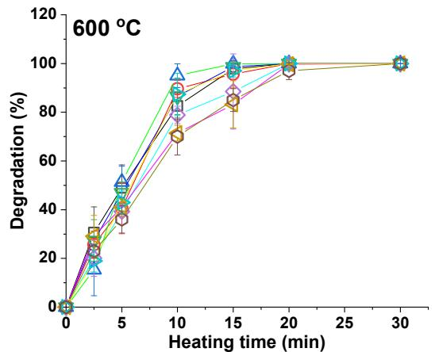

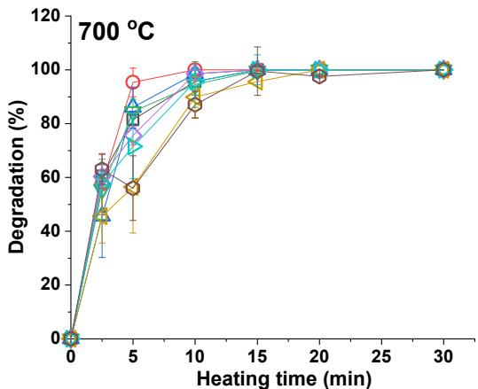

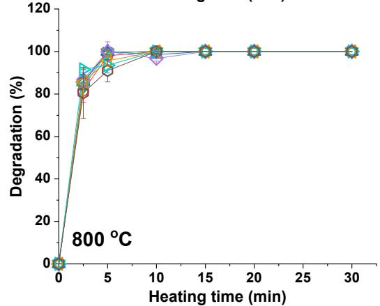

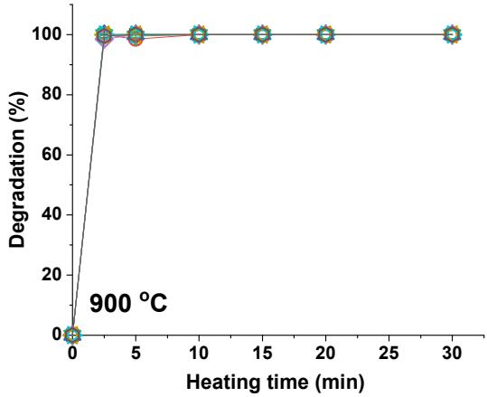

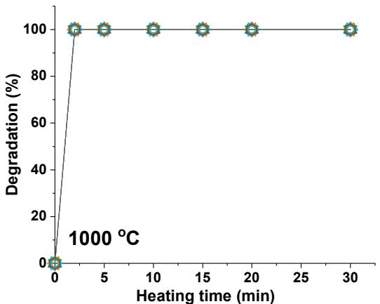

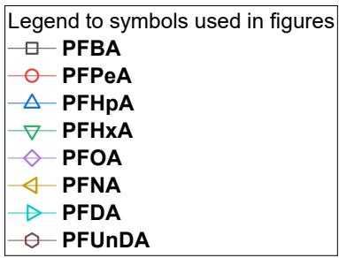  
Figure 1. Degradation of PFCAs during incineration at different times.

# 1.2. Incineration of PFSAs, PFAES, and FTS

The data in Figure 2 summarize the degradation rates of PFSAs, PFBS (C4), PFHxS (C6), and PFOS (C8), across a temperature range of $6 0 0 ^ { \circ } \mathrm { C }$ to $1 0 0 0 ^ { \circ } \mathrm { C }$ during incineration, measured over time. At $6 0 0 ~ ^ { \circ } \mathrm { C }$ , the degradation rates were noticeably slower than at higher temperatures. Initially, the degradation percentages after 2 min for PFBS, PFOS, and PFHxS were $5 . 6 \%$ , $1 1 \%$ , and $1 0 . 2 \%$ respectively. As time progressed, the degradation rates increased gradually, with PFOS showing a notably higher rate of $7 0 . 9 \%$ after 20 min. However, even after $3 0 ~ \mathrm { { m i n } }$ , none of the compounds had reached complete degradation $( \ge 9 9 . 9 9 \%$ or non-detectable residuals), which

signifies the high thermal stability of these compounds at this temperature. At $7 0 0 ~ ^ { \circ } \mathrm { C }$ , all compounds showed a much higher degradation rate. In just 2 min, PFBS, PFOS, and PFHxS degradation percentages were $2 5 . 3 \%$ , $1 5 . 6 \%$ , and $3 5 . 6 \%$ , respectively, showing a substantial increase compared to the results at $6 0 0 ^ { \circ } \mathrm { C }$ . At the 10-min mark, PFHxS had already nearly reached complete degradation at $9 8 . 5 \%$ .

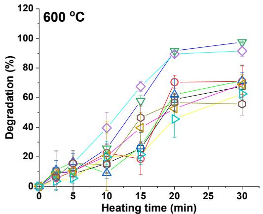

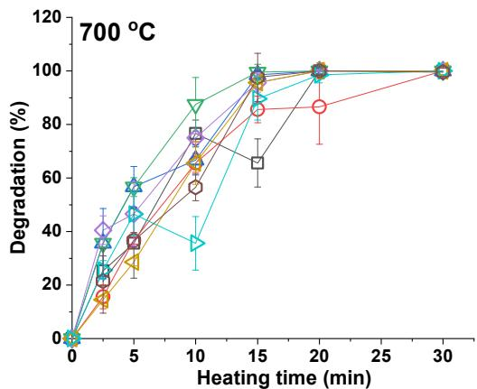

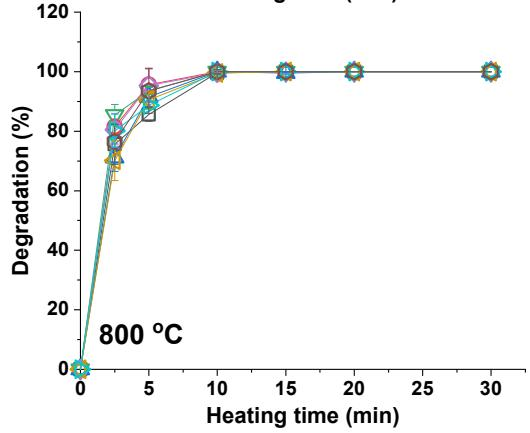

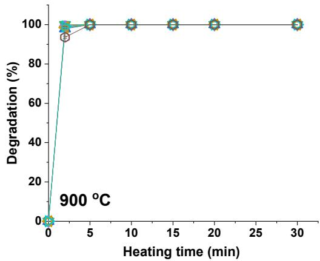

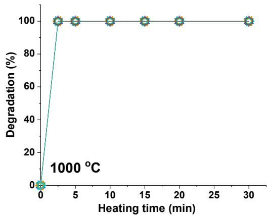

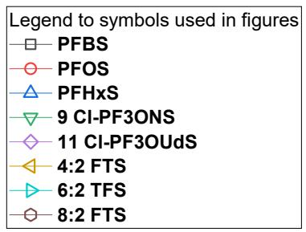  
Figure 2. Degradation of PFSAs, PFAES, and FTS during incineration at different times.

By the 20-min mark, all compounds had achieved complete thermal degradation during incineration. When the temperature was raised to $8 0 0 ~ ^ { \circ } \mathrm { C }$ , the degradation rate increased significantly for all compounds. By 2 min, degradation rates of $7 5 . 6 \%$ , $8 1 . 5 \%$ , and $7 1 . 1 \%$ for PFBS, PFOS, and PFHxS respectively were observed. Complete degradation $( \geq 9 9 . 9 9 \% )$ was reached for

all compounds by the 15-min mark. At $9 0 0 ~ ^ { \circ } \mathrm { C }$ and $1 0 0 0 ~ ^ { \circ } \mathrm { C }$ , the compounds degraded rapidly, reaching near-complete $( \geq 9 9 \% )$ or complete $( { \geq } 9 9 . 9 9 \% )$ degradation within the first 2 min. This suggests an extreme increase in the thermal degradation rate at these temperatures. Overall, it can be concluded that the thermal degradation rate of PFBS, PFOS, and PFHxS increases drastically with incineration temperature. At lower temperatures $( 6 0 0 ~ ^ { \circ } \mathrm { C } )$ , these PFCs exhibit high thermal stability, whereas, at higher temperatures $( 9 0 0 ~ ^ { \circ } \mathrm { C } \mathrm { - } 1 0 0 0 ~ ^ { \circ } \mathrm { C } )$ , they degrade within 2 min. These insights are critical for the safe handling and disposal of PFSAs such as PFOS that are much more difficult to degrade than PFOA by non-thermal approaches.

The incineration of two homologs, 9 Cl-PF3ONS (also known as 6:2 Cl-PFESA or F53-B) and 11 Cl-PF3OUdS, was examined over a range of temperatures, from 600 to $1 0 0 0 ^ { \circ } \mathrm { C } .$ , at varying time intervals. At $6 0 0 ~ ^ { \circ } \mathrm { C }$ , it is apparent that both homologs demonstrate a steady increase in degradation over time. 9 Cl-PF3ONS reached substantial degradation $( 9 7 . 5 \%$ or $90 \mathrm { - } 9 9 \%$ ) after $5 7 . 8 \ \mathrm { m i n }$ , whereas 11 Cl-PF3OUdS achieved a slightly lesser degradation rate of $9 1 . 5 \%$ at the same time. However, with additional heating, 11 Cl-PF3OUdS caught up, reaching nearly complete degradation $( \geq 9 9 \% )$ at the end of the experiment. At $7 0 0 ~ ^ { \circ } \mathrm { C }$ , the rate of thermal degradation accelerated for both homologs, particularly notable for 9 Cl-PF3ONS, which achieved complete $( \geq 9 9 . 9 9 \% )$ degradation after 87.5 min. 11 Cl-PF3OUdS exhibited slower degradation, reaching nearly complete degradation only at the end of the experiment. When heated at $8 0 0 ~ ^ { \circ } \mathrm { C } ,$ , both homologs reached complete degradation at a much quicker rate. It's noteworthy that the degradation rate for 11 Cl-PF3OUdS, which had lagged slightly at lower temperatures, caught up and mirrored that of 9 Cl-PF3ONS at this higher temperature. The thermal degradation rates of both homologs at $9 0 0 ~ ^ { \circ } \mathrm { C }$ and $1 0 0 0 ~ ^ { \circ } \mathrm { C }$ were almost identical. Near-complete degradation was observed almost instantly at $9 0 0 ~ ^ { \circ } \mathrm { C }$ , with complete degradation observed by the 2nd time-point for both homologs. This was similarly observed at $1 0 0 0 ^ { \circ } \mathrm { C }$ . Overall, these results indicate a clear temperature-dependent trend in the thermal degradation of these two homologs. With increasing temperature, the time required for complete degradation decreased significantly. This is a characteristic behavior of thermally labile compounds, which decompose more readily with increasing temperature. Furthermore, despite their structural differences, both homologs displayed very similar thermal degradation profiles, suggesting comparable thermal stabilities and potentially similar decomposition mechanisms. These findings not only enhance our understanding of the thermal properties of these compounds but also provide valuable insights for their safe handling and disposal. The knowledge that complete degradation can be achieved at a certain temperature and timeframe can guide strategies for their incineration treatment, ensuring that potential environmental and health risks are minimized.

Figure 2 also presents the incineration degradation data of a group of fluorotelomer sulfonic acids (4:2 FTS, 6:2 FTS, 8:2 FTS). The degradation data suggest that temperature significantly impacts the degradation rates of all studied FTS. The overall trend is similar to that of PFSAs. At the lowest temperature of $6 0 0 ~ ^ { \circ } \mathrm { C }$ , there is a clear and gradual increase in degradation with longer heating times. For most compounds, the degradation percentage reached a maximum of about 70- $100 \%$ after 20 to 30 min of heating. However, when the temperature was increased to $7 0 0 ~ ^ { \circ } \mathrm { C }$ , a noticeable shift was observed. FTS exhibited significantly higher degradation rates at shorter times. They reached near-complete $( > 9 9 \% )$ or complete $( { \geq } 9 9 . 9 9 \% )$ degradation within 15 to $3 0 ~ \mathrm { m i n }$ . Further increases in temperature to 800 and $9 0 0 ~ ^ { \circ } \mathrm { C }$ only continued this trend, with many compounds reaching near-complete or complete degradation within as little as 5 to $1 0 \ \mathrm { m i n }$ of heating. At $1 0 0 0 ~ ^ { \circ } \mathrm { C }$ , complete degradation was reached almost instantly for all compounds, with virtually no differences observed between the different heating times.

# 1.3. Incineration of PFECAs and FOSAAs

The data in Figure 3 present a comprehensive incineration degradation analysis of PFECAs (PFMPA, HFPO-DA, ADONA) and two FOSSAs (NMeFOSAA and NEtFOSAA) at different heating temperatures (600, 700, 800, 900, and $1 0 0 0 ^ { \circ } \mathrm { C } )$ . In general, it can be observed that the degradation rate of these compounds increases with the temperature. At $6 0 0 ~ ^ { \circ } \mathrm { C }$ , none of the compounds reach $100 \%$ degradation within the provided timeframe. While ADONA and HFPO-DA exhibited complete degradation $( \geq 9 9 . 9 9 \%$ to non-detectable residues), PFMPA lags slightly with the highest recorded degradation at $8 6 . 7 \%$ . NEtFOSAA and NMeFOSAA display a somewhat intermediate behavior, achieving $100 \%$ and $9 9 . 9 9 \%$ degradation respectively. At $7 0 0 ~ ^ { \circ } \mathrm { C }$ , all substances except PFMPA reach $100 \%$ degradation, PFMPA still shows slower degradation reaching a maximum of $100 \%$ . At this stage, the reason for PFMPA’s slower degradation remains unclear.

ADONA and HFPO-DA show a slight increase in degradation rate at this temperature, achieving $100 \%$ degradation faster than at $6 0 0 ^ { \circ } \mathrm { C }$ (Figure 3). At $8 0 0 ^ { \circ } \mathrm { C }$ , all substances reach $100 \%$ degradation. At 900 and $1 0 0 0 ^ { \circ } \mathrm { C }$ , all substances consistently reach $100 \%$ degradation within 2 min. Interestingly, at $9 0 0 ~ ^ { \circ } \mathrm { C }$ , NEtFOSAA shows a slightly slower degradation at $9 9 . 5 \%$ compared to other compounds. However, this difference is negligible and could be within the error margin of the experiment. It is also worth noting the variation in degradation patterns between these substances. While PFMPA exhibits the slowest degradation rate across all temperatures, ADONA and HFPO-DA show relatively fast degradation. NEtFOSAA and NMeFOSAA exhibit intermediate degradation rates (Figure 3).

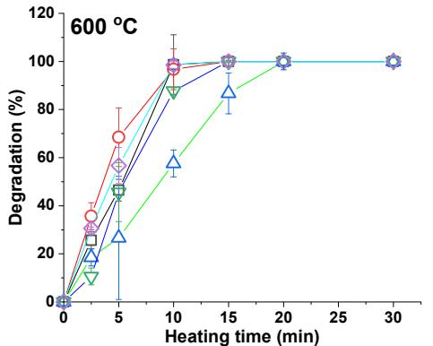

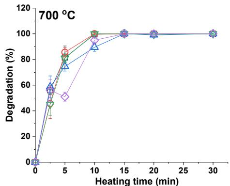

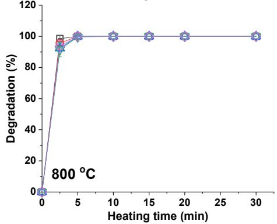

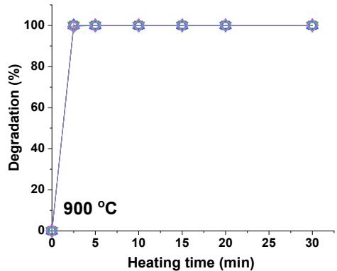

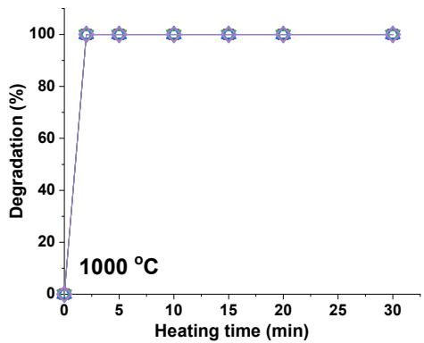

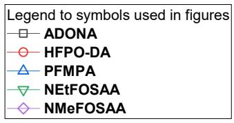  
Figure 3. Degradation of PFECAs and FOSAAs during incineration at different times.

# 1.4. Minimum incineration time required to achieve $9 9 \%$ , $9 9 . 9 \%$ , $9 9 . 9 9 \%$ , and $9 9 . 9 9 9 \%$ degradation of PFAS

By heating these substances to temperatures of 600, 700, 800, 900, and $1 0 0 0 ~ ^ { \mathrm { { o } } } \mathrm { { C } }$ , and measuring the minimum time in minutes needed to achieve $9 9 \%$ (2-log), $9 9 . 9 \%$ , $9 9 . 9 9 \%$ , and $9 9 . 9 9 9 \%$ degradation, we have garnered a deep understanding of the robustness and thermal stability of these compounds. The results are presented in Tables 1 and 2. The degradation of PFAS is significantly influenced by the heating temperature. For instance, at a lower temperature of 600 $^ \mathrm { { \circ } } C$ , the time required to attain $9 9 \%$ degradation for PFCAs ranged from 15 to 30 minutes. However, when the temperature was escalated to $1 0 0 0 ^ { \mathrm { o } } \mathrm { C }$ , the degradation time dramatically reduced to less than 2.5 minutes, indicating a faster degradation rate at higher temperatures. This pattern of accelerated degradation with increased temperature was observed across all studied PFAS. However, there was variability among different PFAS groups. Some substances, such as PFSAs,

demonstrated a slower degradation rate at $6 0 0 ^ { \circ } \mathrm { C }$ , requiring more than 30 minutes to achieve a $9 9 \%$ degradation rate. Yet, a significant reduction in degradation time was noted at $1 0 0 0 ~ ^ { \mathrm { { o } C } }$ , wherein degradation was achieved in less than 2.5 minutes. In the case of FTS, a noticeable resistance to thermal degradation was exhibited at lower temperatures with times greater than 30 minutes needed for $9 9 \%$ degradation at $6 0 0 ~ ^ { \mathrm { o } } \mathrm { C }$ . However, at elevated temperatures, especially at $1 0 0 0 ^ { \circ } \mathrm { C }$ , this resistance diminished, and rapid degradation was accomplished in less than 2.5 minutes. PFECAs and FOSSAs showed relatively less resistance to thermal degradation across all temperatures. At $6 0 0 ^ { \mathrm { o } } \mathrm { C }$ , both PFECAs and FOSSAs achieved $9 9 \%$ degradation within 15 minutes, and this time was further reduced to less than 2.5 minutes at $1 0 0 0 ^ { \circ } \mathrm { C }$ . The data distinctly highlights the thermal dependency of PFAS degradation, reaffirming the crucial role of high temperatures in achieving rapid and comprehensive degradation. While there was a notable difference in the degradation rate among different PFAS, the data establish that their thermal degradation is possible and can be significantly expedited at higher temperatures. These findings are integral in shaping effective waste management strategies and providing robust solutions for PFAS disposal or remediation.

Table 1. Minimum incineration time (min) to achieve $9 9 \%$ (2-log), $9 9 . 9 \%$ (3-log), $9 9 . 9 9 \%$ (4-log), and $9 9 . 9 9 9 \%$ (5-log) degradation of PFCAs, PFSAs, and PFESAs.   

<table><tr><td>Temperature (°C)</td><td>PFCA 99%</td><td>PFCA 99.9%</td><td>PFCA 99.99%</td><td>PFCA 99.999%</td><td>PFSA 99%</td><td>PFSA 99.9%</td><td>PFSA 99.99%</td><td>PFESA 99.999%</td><td>PFESA 99%</td><td>PFESA 99.99%</td><td>PFESA 99.999%</td></tr><tr><td>600</td><td>15</td><td>20</td><td>20</td><td>30</td><td>&gt;30</td><td>&gt;30</td><td>&gt;30</td><td>&gt;30</td><td>&gt;30</td><td>&gt;30</td><td>&gt;30</td></tr><tr><td>700</td><td>10</td><td>15</td><td>20</td><td>30</td><td>20</td><td>20</td><td>20</td><td>30</td><td>15</td><td>20</td><td>20</td></tr><tr><td>800</td><td>5</td><td>5</td><td>10</td><td>15</td><td>5-10</td><td>10</td><td>15</td><td>20</td><td>5-10</td><td>10</td><td>15</td></tr><tr><td>900</td><td>&lt;2</td><td>&lt;5</td><td>5</td><td>5</td><td>2</td><td>5</td><td>5</td><td>5</td><td>2</td><td>&lt;5</td><td>5</td></tr><tr><td>1000</td><td>&lt;2</td><td>&lt;2</td><td>&lt;2</td><td>&lt;2</td><td>&lt;2</td><td>&lt;2</td><td>&lt;2</td><td>&lt;2</td><td>&lt;2</td><td>&lt;2</td><td>&lt;2</td></tr></table>

Table 2. Minimum incineration time (min) to achieve $9 9 \%$ (2-log), $9 9 . 9 \%$ (3-log), $9 9 . 9 9 \%$ (4-log), and $9 9 . 9 9 9 \%$ (5-log) degradation of FTS, PFECAs, and FOSSAs.   

<table><tr><td>Temperature (℃)</td><td>FTS 99%</td><td>FTS 99.9%</td><td>FTS 99.99%</td><td>FTS 99.999%</td><td>PFECAsa 99%</td><td>PFECAsa 99.9%</td><td>PFECAsa 99.99%</td><td>PFECAsa 99.999%</td><td>FOSSAs 99%</td><td>FOSSAs 99.9%</td><td>FOSSAs 99.99%</td><td>FOSSAs 99.999%</td></tr><tr><td>600</td><td>&gt;30</td><td>&gt;30</td><td>&gt;30</td><td>&gt;30</td><td>10-15</td><td>15</td><td>15</td><td>15</td><td>15</td><td>15</td><td>15</td><td>15</td></tr><tr><td>700</td><td>15-20</td><td>20</td><td>20</td><td>30</td><td>10</td><td>10</td><td>15</td><td>15</td><td>10</td><td>10</td><td>15</td><td>15</td></tr><tr><td>800</td><td>5-10</td><td>10</td><td>15</td><td>15</td><td>2</td><td>2</td><td>2-5</td><td>2-5</td><td>5</td><td>10</td><td>10</td><td>10</td></tr><tr><td>900</td><td>2</td><td>5</td><td>5</td><td>5</td><td>&lt;2</td><td>&lt;2</td><td>&lt;2</td><td>&lt;2</td><td>&lt;5</td><td>&lt;5</td><td>&lt;5</td><td>&lt;5</td></tr><tr><td>1000</td><td>&lt;2</td><td>&lt;2</td><td>&lt;2</td><td>&lt;2</td><td>&lt;2</td><td>&lt;2</td><td>&lt;2</td><td>&lt;2</td><td>&lt;2</td><td>&lt;2</td><td>&lt;2</td><td>&lt;2</td></tr></table>

Notes: ">" means that the actual time required is more than the value given. "<" means that the actual time required is less than the value given. "X‒Y" means the actual time required falls within this range.

# Chapter 2. Thermal Degradation of PIDs.

# 2.1. Thermal Degradation and Mineralization.

Temperature shifts have demonstrated a distinct effect on PFAS degradation efficiency;14- 16, 20 however, information on the temperature effects on PFC thermal degradation remains limited. As depicted in Figure 4a, near-complete degradation of $\mathrm { C } _ { 7 } \mathrm { F } _ { 1 4 }$ was achieved at temperatures above $3 0 0 ~ ^ { \circ } \mathrm { C }$ , with the yield of fluorine (F) increasing modestly and peaking at $2 4 . 0 \ \mathrm { m o l \% }$ at $4 0 0 ~ ^ { \circ } \mathrm { C }$ , before slightly decreasing at higher temperatures. Similarly, $\mathrm { C } _ { 8 } \mathrm { F } _ { 1 6 }$ showed trends of complete degradation at $3 0 0 ~ ^ { \circ } \mathrm { C }$ and above, with a significant increase in F yield at elevated temperatures, as shown in Figure 4b. In contrast, saturated PFCs $\mathrm { ( C _ { 7 } F _ { 1 4 } }$ and $\mathrm { C } _ { 8 } \mathrm { F } _ { 1 6 } )$ exhibited complete degradation only at temperatures exceeding $5 0 0 ^ { \circ } \mathrm { C }$ . The generation of organofluorine compounds is the dominant pathway during thermal decomposition, with a notably low yield of inorganic F $( { < } 1 0 \mathrm { m o l \% } )$ across the temperature range studied (Figures 4a and 4b).

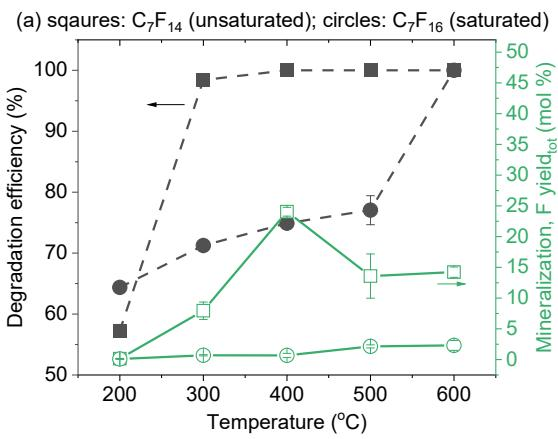

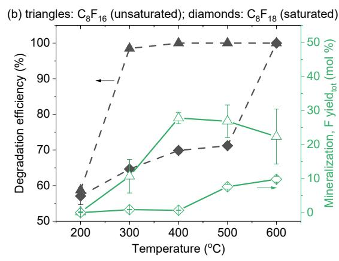

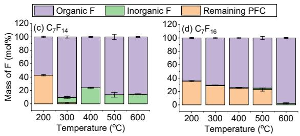

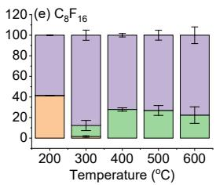

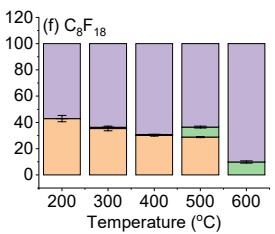  
Figure 4. Degradation and mineralization of four PFCs heated in air at different temperatures (200, 300, 400, 500, and $6 0 0 ~ ^ { \circ } \mathrm { C } )$ for 60 min. (a): C7 PFCs. (b): C8 PFCs. (c)‒(f): Mass flows of organic fluorinated degradation products, inorganic F, and rema

The organofluorine products of PFCs at a given temperature were estimated based on the difference between the initial mass of PFC added to the reactor and the mass of inorganic F at this temperature. As shown in Figure 4c, the mass flows of organic F from $\mathrm { C } _ { 7 } \mathrm { F } _ { 1 4 }$ started at $5 3 . 6 \mathrm { m o l \% }$ at $2 0 0 ~ ^ { \circ } \mathrm { C }$ and reached a peak of $9 0 . 5 ~ \mathrm { m o l \% }$ at $3 0 0 ~ ^ { \circ } \mathrm { C }$ before slightly dropping to $7 5 . 9 \mathrm { \ m o l \% }$ at $4 0 0 ~ ^ { \circ } \mathrm { C }$ and stabilizing around $8 5 . 0 \ \mathrm { m o l \% }$ at 500 and $6 0 0 ~ ^ { \circ } \mathrm { C }$ . This result suggests that as $\mathrm { C } _ { 7 } \mathrm { F } _ { 1 4 }$ decomposes, a significant portion of the resulting products are organic F compounds.

In the case of ${ \mathrm { C } } _ { 8 } { \mathrm { F } } _ { 1 6 } .$ , the organic F content followed a similar trend, starting at $5 8 . 6 \mathrm { m o l \% }$ at $2 0 0 ~ ^ { \circ } \mathrm { C }$ and rising to $8 7 . 8 ~ \mathrm { m o l \% }$ by $3 0 0 ~ ^ { \circ } \mathrm { C }$ . At higher temperatures, the organic F slightly

declined and stabilized approximately at $7 5 \mathrm { \ m o l \% }$ (Figure 4e). For saturated PFCs, the majority of F remained in the undegraded PFCs, as depicted in Figures 4d and 4f.

Further supporting these observations, Khan et al. explored the thermal mineralization mechanisms of perfluorooctanesulfonic acid (PFOS), identifying that at 1000 K, PFOS preferentially forms a-sultone, which swiftly decomposes into perfluorooctanal and SO2 with a rapid half-life of 0.2 seconds. These insights, highlighting a highly efficient breakdown process, emphasize the potential of tailored thermal treatments to significantly enhance the degradation efficiency of PFAS compounds under relatively modest temperatures, achieving up to approximately 40% mineralization between 300–500 °C.48 $40 \%$ $3 0 0 { - } 5 0 0 ^ { \circ } \mathrm { C }$

The presence of GAC significantly enhanced the degradation efficiency of $\mathrm { C } _ { 7 } \mathrm { F } _ { 1 4 }$ , achieving $100 \%$ at $2 0 0 ^ { \circ } \mathrm { C }$ (Figure 5a), reflecting a $4 2 . 7 \%$ degradation enhancement. Additionally, at $5 0 0 ^ { \circ } \mathrm { C }$ , the F yield for $\mathrm { C } \mathrm { 7 F } _ { 1 4 }$ increased to $32 \mathrm { m o l } \%$ , representing an $8 \%$ increase in comparison with the no-GAC scenario. Similarly, as highlighted in Figure 5b, for $\mathrm { C } _ { 8 } \mathrm { F } _ { 1 6 }$ , the presence of GAC resulted in a degradation efficiency of $9 9 . 6 \%$ at $2 0 0 ~ ^ { \circ } \mathrm { C }$ , marking a $4 0 . 8 \%$ enhancement, and the F yield rose to $4 1 . 8 \ : \mathrm { m o l \% }$ , indicating a $1 4 . 1 \%$ increase at $5 0 0 ^ { \circ } \mathrm { C }$ .

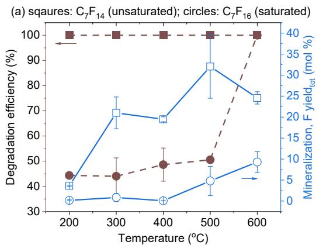

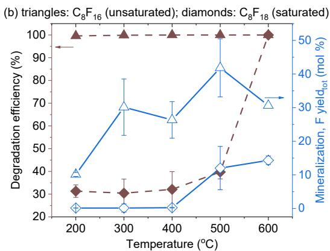

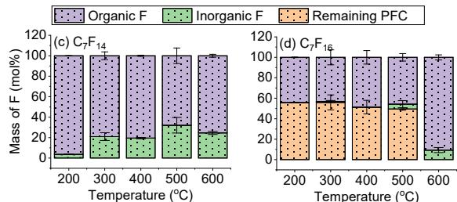

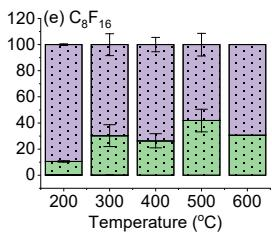

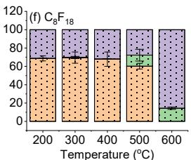  
Figure 5. Degradation and mineralization of four PFCs heated in air at different temperatures (200, 300, 400, 500, and $6 0 0 ~ ^ { \circ } \mathrm { C } )$ for $6 0 \mathrm { { m i n } }$ in the presence of GAC. (a): C7 PFCs. (b): C8 PFCs. (c)‒(f): Mass flows of organic fluorinated degradation products, inorganic F, and remaining PFC after heating at these temperatures.

On the other hand, the effect of GAC on the thermal degradation of saturated PFCs is not evident. In fact, in some cases, GAC appears to have an inhibitory effect on the degradation of saturated PFCs, leading to a around $20 \%$ drop in degradation efficiency compared to scenarios without GAC (Figures 4 and 5).

The mass flow of organic F from $\mathrm { C } _ { 7 } \mathrm { F } _ { 1 4 }$ began at a high of $9 6 . 4 \mathrm { \ m o l \% }$ at $2 0 0 ~ ^ { \circ } \mathrm { C }$ in the presence of GAC, then gradually declined to $6 8 . 0 \mathrm { m o l \% }$ by $5 0 0 ^ { \circ } \mathrm { C }$ (Figure 5c). $\mathrm { C } _ { 8 } \mathrm { F } _ { 1 6 }$ exhibited a similar trend, though it had a higher proportion of inorganic F compared to $\mathrm { C } _ { 7 } \mathrm { F } _ { 1 4 }$ (Figure 5e).

For saturated PFCs, with GAC, the mass percentage of organic F was low across 200 to $5 0 0 ~ ^ { \circ } \mathrm { C }$ , approximately $45 \mathrm { m o l } \%$ for $\mathrm { C } \mathrm { 7 F _ { 1 6 } }$ and $30 \mathrm { m o l \% }$ for $\mathrm { C } _ { 8 } \mathrm { F } _ { 1 8 }$ , due to the poor degradation of these two saturated compounds. At $6 0 0 ^ { \circ } \mathrm { C }$ , significant degradation occurs, increasing the organic F mass percentage to $9 0 . 7 \mathrm { m o l \% }$ for $\mathrm { C } \mathrm { 7 F _ { 1 6 } }$ and $8 5 . 7 \mathrm { m o l \% }$ for $\mathrm { C } _ { 8 } \mathrm { F } _ { 1 8 }$ .

As shown in Figures 4 and 5, we observed a decline in the yield of F at temperatures exceeding $4 0 0 ~ ^ { \circ } \mathrm { C }$ in certain cases. The precise reason behind this trend is currently unclear. A plausible explanation could be that the consumption of F radicals by intermediate products during the degradation process contributes to the observed decline in yield.

In summary, all four PFCs effectively degrade at specific temperatures—above $2 0 0 ^ { \circ } \mathrm { C }$ for perfluoroalkenes and above $6 0 0 ^ { \circ } \mathrm { C }$ for perfluoroalkanes. The release of F generally increases with temperature, although the specific yield percentages for saturated PFCs remain low. Saturated PFCs, such as perfluoroalkanes, show significantly greater thermal stability compared to perfluoroalkyl carboxylic acids (PFCAs),15, 20, 49 which start to degrade between $1 5 0 ^ { \circ } \mathrm { C }$ and $3 0 0 ^ { \circ } \mathrm { C }$ Conversely, unsaturated PFCs, like perfluoroalkenes, exhibit similar thermal stability to PFCAs.

# 2.2. Organofluorine Byproducts of PFCs.

Figure 2.1 (Appendices) depicts the abundance of selected byproducts formed during the degradation of a mixture of four tested PFCs, both with and without the presence of GAC. The thermal treatment duration (10, 60, 120 min), as shown in Figure 2.1a, did not significantly affect the overall abundance of potential byproducts. A notable finding is the distinct difference in byproduct abundance between scenarios 2.1 with GAC and without GAC. The presence of GAC notably enhanced the yield of linear and cyclic organofluorine byproducts throughout the process, which is attributed to GAC's promotion of PFC degradation.

Moreover, as shown in Figure 2.1b (Appendices), there was a decrease in the abundance of all detectable byproducts as the temperature increases from $2 0 0 ~ ^ { \circ } \mathrm { C }$ to $6 0 0 ~ ^ { \circ } \mathrm { C }$ . These products became non-detectable at temperatures exceeding $5 0 0 ~ ^ { \circ } \mathrm { C }$ , indicating the decomposition of these organofluorine byproducts. Our previous investigation of the thermal decomposition products from aqueous film forming foam (AFFF), PFOA, PFOS, and other PFAS revealed a comparable pattern.18-20 These compounds exhibited peak byproducts diversity and intensity at intermediate temperatures $2 0 0 ~ ^ { \circ } \mathrm { C }$ to $5 0 0 ~ ^ { \circ } \mathrm { C }$ ) subsequently diminishing to trace levels at temperatures above $8 9 0 ^ { \circ } \mathrm { C }$ .

It is worth mentioning that the degradation products analyzed in Figure 2.1 (Appendices) were only those with a GC retention time greater than 8.7 min. In accordance with our GC-MS center's policy, we conducted MS analysis on products that have a retention time exceeding that of n-hexane $( 8 . 4 \ \mathrm { m i n } )$ . This procedure was to ensure accurate differentiation and analysis of compounds of interest. To gain further insight into potential byproducts formed at a wider GC retention time range, we used two approaches. The first approach involved the analysis of selected samples at $3 0 0 ^ { \circ } \mathrm { C }$ with a wider GC retention time range. Perfluoro-1-butene $\mathrm { ( C _ { 4 } F _ { 8 } }$ ; retention time $7 . 4 0 \mathrm { m i n } )$ emerged as the dominant decomposition product of PFCs under both oxidative and inert atmospheres. Interestingly, experiments with GAC did not exhibit a corresponding peak for this compound, suggesting GAC's ability to change the degradation pathways of PFCs and/or inhibit the generation of this compound. The generation of C4F8 has also been reported as a fluorinated volatile byproduct of AFFF and individual PFAS, such as PFOS and perfluorovaleric acid (C5) decomposition in prior studies.18-20

The second approach involved the analysis of the thermal degradation products of PFCs using TD‒Pyr−GC−MS, where the compound was directly heated, and the resultant species were

examined through GC−MS. For both PFCs, the presence of byproducts increased significantly as temperatures rose from 50 to $5 0 0 ~ ^ { \circ } \mathrm { C }$ , indicating enhanced thermal degradation. At lower temperatures $( 5 0 - 2 0 0 ^ { \circ } \mathrm { C } )$ , byproducts with relatively low molecular weights were predominantly observed, suggesting initial breakdown processes.24 As the temperature reached $2 0 0 { - } 3 0 0 ^ { \circ } \mathrm { C }$ and above, a greater variety of linear and cyclic degradation products with varying complexities appeared. Notably, by $5 0 0 ^ { \circ } \mathrm { C }$ , almost no peaks were detectable for either compound, implying near-total degradation.

# 2.3. Bond Energy Distribution.

To further understand the thermal degradation behaviors observed in our experiments with PFCs, we analyzed bond dissociation free energies (BDFEs) among the investigated compounds. BDFEs reflect the energy required to break a specific chemical bond, with a lower BDFE indicating a weaker bond that is more susceptible to cleavage during thermal treatment. $^ { 2 0 } \mathrm { C - F }$ bonds and double C–C bonds are generally very strong due to the high electronegativity of F and the presence of two shared electron pairs in the double bond, respectively (Figure 2.2; Appendices). As shown in Figure 2.2, saturated PFCs ( $\mathrm { C } 7 \mathrm { F } _ { 1 6 }$ and C8F18), due to their symmetrical structure with a repeated pattern of single $\mathrm { C } \mathrm { - } \mathrm { C }$ bonds, exhibit less variation in their BDFE values (Figure 2.2). All their BDFE values fall within a relatively narrow range of 71.8 kcal/mol to 75.9 kcal/mol. This consistency reflects the uniform distribution of bond strengths across the molecule in saturated PFCs.

Unsaturated PFCs $\mathrm { C } \mathrm { 7 F } _ { 1 4 }$ and $\mathrm { C } _ { 8 } \mathrm { F } _ { 1 6 } )$ possess the strongest bonds (C2–C3) among the investigated molecules, with a BDFE of 91.2 kcal/mol, likely reinforced by the adjacent double bond $\scriptstyle ( \mathbf { C } 1 = \mathbf { C } 2 )$ as depicted in Figure 2.2. Conversely, these compounds also exhibit the weakest bonds (C3–C4) among all $\mathrm { C } { \mathrm { - } } \mathrm { C }$ bonds involved, with BDFE values of approximately 66.1 kcal/mol. This discrepancy highlights that the single bond between the third and fourth C atoms is particularly susceptible to cleavage (Figure 2.2), contributing to the lower thermal stability observed in these unsaturated PFCs compared to their saturated counterparts (Figures 4 and 5).

Thermal Decomposition Pathways of Perfluoroalkenes. Based on our qualitative and quantitative analysis of byproducts, we propose possible thermal degradation pathways of perfluoroalkenes as shown in Figure 2.3 (Appendices).

Two primary transformation routes are possible: chain scission and cyclization. Chain scission occurs through a series of steps involving hemolytic cleavage of C‒C bonds and F atom transfer, resulting in the generation of shorter-chain perfluoroalkenes and perfluoroalkanes (e.g., perfluoro-1-butene; C4F8). Following the bond cleavage, the radical perfluoroalkyl chains can also undergo intramolecular free radical cyclization to generate perfluorocycloalkenes. This process is energetically favorable since it reduces the overall energy of the system by eliminating the radicals and forming more stable compounds. The cyclization process yields different perfluorocycloalkenes, such as perfluorocyclopentane $\left( \mathrm { C } _ { 5 } \mathrm { F } _ { 1 0 } \right)$ and perfluorocyclohexane $\left( \mathrm { C } _ { 6 } \mathrm { F } _ { 1 2 } \right)$ . Similar cyclic perfluorocarbons have been identified as gaseous PFAS byproducts in other studies investigating the degradation of perfluorinated compounds.50-51

Intermediates and radical fluorocarbon chains can undergo reaction pathways during the heating process and subsequent cooling period, potentially influencing the final product distribution. However, our analysis suggests that the bulk of the initial mass of perfluoroalkenes follows pathways through C3−C4 carbon cleavage, as this bond poses lower BDFE than others. Following this initial cleavage, the molecules proceed along a path that results in the formation of

perfluoro-1-butene and perfluorocyclohexane, considering the high abundance of these compounds in thermally treated samples.

# 2.4. Post-treatment of PIDs.

In our previous studies, we have found that GAC enhanced the mineralization of PFOA and its homologs,15, 20 suggesting that the thermal degradation pathways of PFAS can be altered. As $\mathrm { C } _ { 7 } \mathrm { F } _ { 1 4 }$ and other PFCs included in these studies are PIDs of PFOA, we examined whether GAC can also enhance the mineralization of these PFCs. In addition to GAC, we also included a few commercial catalysts such as platinum on alumina $\left( \mathrm { P t } / \mathrm { A l } _ { 2 } \mathrm { O } _ { 3 } \right)$ and palladium on alumina $\mathrm { ( P d / A l _ { 2 } O _ { 3 } ) }$ .

As shown in Figure 2.4 (Appendices), while all amendments have shown a positive impact on inorganic fluoride yield, the extent of this enhancement varied considerably. The highest total fluoride yield was observed by introducing hydrogen zeolite Y to the system, which yielded 24.8 $\mathrm { m o l \% }$ . GAC amendments (F200, Norit 400, and HD 400) also boosted the F yields of $\mathrm { C } _ { 8 } \mathrm { F } _ { 1 6 }$ upon heating, ranging from $1 5 . 5 \ \mathrm { m o l \% }$ (F200) to $1 8 . 3 \mathrm { \ m o l \% }$ (HD 4000). Other commercial catalysts such as a silica-alumina catalyst support, $\mathrm { P d } / \mathrm { A l } _ { 2 } \mathrm { O } _ { 3 }$ , and $\mathrm { P t } / \mathrm { A l } _ { 2 } \mathrm { O } _ { 3 }$ only slightly increased the yield of F, ranging from $3 . 7 \mathrm { \ m o l \% }$ to $3 . 9 \mathrm { \ m o l \% }$ . Among the other amendments, including molecular sieve, activated alumina, biochar, and iron filings showed no sign of increasing the yield of F (Figure 2.4; Appendices).

The thermal surface reactions of PFAS with these additives are potentially complicated and are likely influenced by the physicochemical properties of the surfaces involved and the specific environmental conditions. Biswas and Wong have significantly advanced our understanding of PFOA's thermal mineralization mechanisms through ab initio molecular dynamics simulations.52 Their research elucidates that PFOA does not degrade on pristine $\gamma$ -Al2O3 (100) surfaces even under high temperatures. However, introducing an oxygen vacancy dramatically alters this behavior, facilitating rapid defluorination and bond cleavage, thus offering a potential pathway to enhance the effectiveness of thermal treatments in environmental remediation of such persistent pollutants.52

Among the investigated amendments, GAC offers several distinct advantages. Firstly, GAC is a well-established material with extensive applications in environmental remediation, particularly for the treatment of PFAS in water.53-56 Its effectiveness in adsorbing PFAS from aqueous environments is a well-documented approach for mitigating PFAS contamination. Secondly, GAC possesses a relatively low cost and a readily scalable production process compared to some commercial catalysts. This economic feasibility is crucial for the widespread applications. GAC outperforms other additives (Figure 2.4; Appendices) in promoting the thermal mineralization of PFCs primarily due to its high surface area and strong adsorptive capacity. These properties enable GAC to more effectively capture and break down PFCs, especially at lower temperatures where other additives may not be as efficient. Furthermore, GAC's structure allows for the adsorption of intermediate products that might otherwise inhibit further degradation, enhancing the overall efficiency of the mineralization process. This capability is particularly evident in Figures 2.4 and 2.5 (Appendices), where the use of GAC not only boosted the F yields significantly across various temperatures but also facilitated the rapid degradation of both saturated and unsaturated PFCs, underscoring its superior performance in environmental remediation applications.

Next, we conducted further detailed investigations into the effects of GAC on the thermal mineralization of PFCs with varying structures. Figure 2.5 shows that GAC enhances the total F

yield during the thermal degradation of both saturated and unsaturated PFCs, with a more notable effect on unsaturated PFCs. Specifically, GAC significantly increased F production in unsaturated PFCs, achieving up to $3 2 . 2 \mathrm { m o l \% }$ for $\mathrm { C } _ { 7 } \mathrm { F } _ { 1 4 }$ and $4 2 . 5 \mathrm { m o l \% }$ for $\mathrm { C } _ { 8 } \mathrm { F } _ { 1 6 }$ at $5 0 0 ^ { \circ } \mathrm { C }$ . This enhancement was evident even at lower temperatures, such as $2 0 0 ^ { \circ } \mathrm { C }$ . Interestingly, similar effects of GAC on increasing F yields at low temperatures were previously observed for PFCAs, including PFOA).15 The findings from this study (Figure 2.5; Appendices) suggest that the positive impact of GAC on thermal PFCA degradation may be linked to its role in enhancing the mineralization of their fluorinated precursors (i.e., unsaturated PFCs).

For the saturated PFCs, $\mathrm { C } \mathrm { 7 F } _ { 1 6 }$ and $\mathrm { C } _ { 8 } \mathrm { F } _ { 1 8 }$ , the data from Figure 2.5 also shows a considerable increase in F yield with the presence of GAC at $5 0 0 ~ ^ { \circ } \mathrm { C }$ and $6 0 0 ~ ^ { \circ } \mathrm { C }$ . This enhancement indicates that GAC not only facilitates the breakdown of unsaturated PFCs but also significantly improves the thermal mineralization of their saturated counterparts at elevated temperatures.

Note that the total F yield (Eqs 3 and 4) generally aligns with the relative F yield, due to the efficient degradation of perfluoroalkenes during thermal treatment, resulting in negligible residual mass $( M _ { \mathrm { P F C , r } } \approx 0 )$ ).

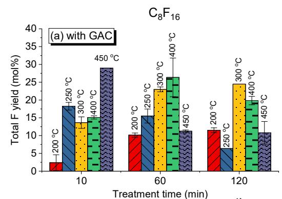

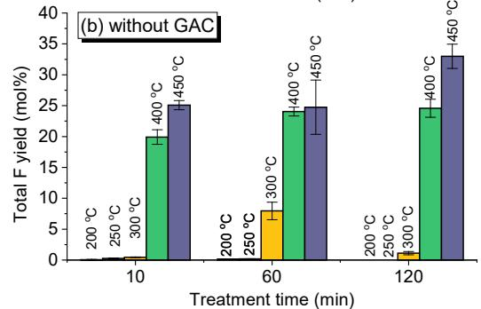

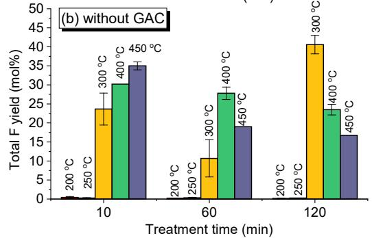  
Figure 6. Thermal mineralization of PFCs heated in selective temperatures and durations.

Figure 6 shows the time-dependent effects of GAC on the mineralization of these PFCs (Figure 6). At $2 0 0 ^ { \circ } \mathrm { C }$ , the yield of F from $\mathrm { C } _ { 7 } \mathrm { F } _ { 1 4 }$ after 10-min heating was much higher $( 4 . 5 \mathrm { m o l \% } )$ compared to the absence of GAC $( < 0 . 1 \mathrm { m o l \% } )$ . This trend continued at $6 0 \mathrm { { m i n } }$ , where the yield of F with GAC was $3 . 6 \mathrm { m o l \% }$ , compared to $0 . 2 \mathrm { m o l } \%$ without GAC. At higher temperatures $2 5 0 ^ { \circ } \mathrm { C }$ and $3 0 0 ~ ^ { \circ } \mathrm { C } )$ , the data shows a similar pattern where GAC presence enhanced the mineralization substantially. For instance, at $3 0 0 ~ ^ { \circ } \mathrm { C }$ , the yield of F with GAC was $1 0 . 0 \ \mathrm { m o l \% }$ after 10 min and peaked at $2 1 . 0 \mathrm { m o l \% }$ at $6 0 \mathrm { { m i n } }$ , whereas without GAC, the yield of F was $8 . 0 \mathrm { m o l } \%$ after 60 min

heating at $3 0 0 ~ ^ { \circ } \mathrm { C }$ . The influence of GAC on the yield of F from $\mathrm { C } _ { 7 } \mathrm { F } _ { 1 4 }$ diminished at $4 0 0 ~ ^ { \circ } \mathrm { C }$ , at which the yields of F with GAC were comparable with those without the presence of GAC (Figure 6). Interestingly, at $5 0 0 ~ ^ { \circ } \mathrm { C }$ and $6 0 0 ~ ^ { \circ } \mathrm { C }$ , the catalytic effect of GAC was once again evident, increasing the yield of F from $\mathrm { C } _ { 7 } \mathrm { F } _ { 1 4 }$ as high as $5 7 \%$ (Figure 2.7; Appendices).

Similar to $\mathrm { C } _ { 7 } \mathrm { F } _ { 1 4 }$ , at $2 0 0 ~ ^ { \circ } \mathrm { C }$ , the presence of GAC showed a substantial effect on the yield of $\mathrm { C } _ { 8 } \mathrm { F } _ { 1 6 }$ (Figure 6), significantly enhancing it across all time points. For example, with GAC, the yield of F from $\mathrm { C } _ { 8 } \mathrm { F } _ { 1 6 }$ was $2 . 4 \ : \mathrm { m o l \% }$ after 10-min treatment and increased to $1 1 . 5 \mathrm { m o l \% }$ at $1 2 0 \mathrm { m i n }$ . In contrast, without GAC, the maximum yield of F was ${ \sim } 0 . 4 \mathrm { m o l } \%$ over the same period. At $2 5 0 ^ { \circ } \mathrm { C }$ the effect of GAC continues to be prominent. The yield of F peaked at $1 8 . 2 \mathrm { m o l \% }$ after 10-min thermal treatment at $2 5 0 ~ ^ { \circ } \mathrm { C }$ in the presence of GAC. In contrast, without GAC, the yield of F was never above $0 . 5 \mathrm { m o l } \%$ . The effect of GAC diminished at $4 0 0 ~ ^ { \circ } \mathrm { C }$ but became significant again at $5 0 0 ~ ^ { \circ } \mathrm { C }$ and $6 0 0 ~ ^ { \circ } \mathrm { C }$ . For example, the yield of F from $\mathrm { C } _ { 8 } \mathrm { F } _ { 1 6 }$ rose to $4 8 . 0 \mathrm { m o l \% }$ , compared to just $2 3 . 5 \mathrm { m o l \% }$ without GAC after 60-min heating at $5 0 0 ^ { \circ } \mathrm { C }$ .

# 2.5. Effects of Atmosphere.

We also compared the effects of atmosphere on the thermal mineralization of theses PFCs. As shown, air favored the mineralization of both unsaturated and saturated PFCs at low temperatures (200 and 300 °C).24 $3 0 0 ^ { \circ } \mathrm { C }$

In both atmospheres, the addition of GAC boosted the mineralization of both PFCs at temperatures up to $3 0 0 ~ ^ { \circ } \mathrm { C }$ . However, at $4 0 0 ~ ^ { \circ } \mathrm { C }$ , there was a notable surge in the mineralization $( \sim 6 0 \mathrm { m o l \% }$ of F) of both unsaturated PFCs in ${ \Nu } _ { 2 }$ without GAC, compared to the mineralization conditions in air. We repeated multiple times on this datapoint, and the observation is consistent. This difference could be attributed to the consumption of F radicals by oxygen or alternative mineralization pathways of these compounds in the air.24

# Chapter 3. Nondestructive detection of PIDs of PFAS

While GC-MS(/MS) can provide important information regarding the PIDs from PFAS, some small PIDs may not easy to ionize in MS. In this regard, we explored a nondestructive, realtime analytical method (TGA−FTIR) to analyze PIDs of PFAS.

# 3.1. Reference FTIR Spectra of PFCs, HFCs, and Other Potential Thermal Degradation Products of PFAS.

We begin with a brief overview of the FTIR spectra of reference compounds gathered from the U.S. National Institute of Standards and Technology database42, 57-64 and a recent study by the U.S. Pacific Northwest National Laboratory. 59 The spectrum35, 57 of $\mathrm { C F } _ { 2 } \mathrm { O }$ exhibits a prominent absorption near $1 9 3 5 ~ \mathrm { c m ^ { - 1 } }$ , characteristic of the ${ \mathrm { C } } { = } { \mathrm { O } }$ stretching vibration, with additional peaks at ${ \sim } 1 2 3 2$ and ${ \sim } 1 0 2 8 ~ \mathrm { c m ^ { - 1 } }$ representing the stretching and bending vibrations of $\mathrm { C - F }$ (Figure 3.1a; Appendices). The spectrum of $\mathrm { S i F _ { 4 } }$ shows a sharp and intense peak at ${ \sim } 1 0 3 0 \mathrm { c m ^ { - 1 } }$ , 58, 65 attributable to the stretching vibration of the strong Si–F bond (Figure 3.1a; Appendices).

Characteristic peaks at ${ \sim } 1 2 5 0$ and $1 1 1 4 \mathrm { c m } ^ { - 1 }$ were observed in both PFCs (Figures 3.1b and 3.1d; Appendices) 59, 61-64 and HFCs (Figure 3.1c; Appendices). 59-60 Compared to short-chain PFCs, long-chain PFCs and HFCs exhibit two characteristic peaks at 1220−1206 and $1 1 5 5 { - } 1 1 4 5 ~ \mathrm { c m ^ { - 1 } }$ (Figure 3.1c). The spectrum of $\mathrm { C F _ { 4 } }$ is noted for a single peak at $1 2 5 0 \mathrm { c m } ^ { - 1 }$ .

For perfluoroalkenes, the peaks at $1 7 8 9 \mathrm { c m } ^ { - 1 }$ and $1 7 2 0 \mathrm { c m } ^ { - 1 }$ represent the $\mathrm { C } { = } \mathrm { C }$ stretch of a double bond in perfluoro-1-alkenes (e.g., perfluorohept-1-ene) and perfluorohept-2-ene,

respectively. Cyclooctafluorobutane $\mathrm { ( C _ { 4 } F _ { 8 } ) }$ displays a dominant peak at $9 6 2 ~ \mathrm { c m } ^ { - 1 }$ (Figure 3.1b; Appendices).

# 3.2. Thermal Degradation Products of PFOA Investigated by TGA-FTIR.

Detailed investigations focused on the thermal decomposition of PFOA and K-PFOS across a range of temperatures. Panels (a) and (b) in Figure 3.2 present the FTIR spectra of PFOA when heated up to $7 0 0 ~ ^ { \circ } \mathrm { C }$ in ${ \Nu } _ { 2 }$ and air, respectively. In ${ \Nu } _ { 2 }$ , the spectrum for PFOA at $1 5 0 ~ ^ { \circ } \mathrm { C }$ is very similar to the reference spectrum,66 suggesting little to no decomposition at this temperature. The results align with our previous observation15 that the thermal degradation of PFOA is either thermodynamically or kinetically unfavorable at $1 5 0 ~ ^ { \circ } \mathrm { C }$ . Above $1 5 0 ~ ^ { \circ } \mathrm { C }$ , characteristic peaks of PFOA associated with the O–H stretch at $3 6 0 0 ~ \mathrm { { c m } ^ { - 1 } }$ , the $\mathrm { C } { = } \mathrm { O }$ stretch at $1 8 1 7 ~ \mathrm { c m } ^ { - 1 }$ , and $\mathrm { C F } _ { 3 }$ vibrations around $1 2 5 0 ~ \mathrm { c m ^ { - 1 } }$ began to decline in intensity, pointing to initiation of thermal degradation (Figure 3.2a; Appendices).

Simultaneously, new peaks emerged at ${ \sim } 1 2 0 5$ and ${ \sim } 1 1 4 5 ~ \mathrm { c m ^ { - 1 } }$ (Figure 3.2; Appendices). Weber et al. recently identified perfluorooctanoyl fluoride $\mathrm { ( C 8 F 1 6 O ) }$ from PFOS in thermal processes, based on peaks observed at approximately $1 2 0 7 ~ \mathrm { c m } ^ { - 1 }$ and $1 1 4 5 ~ \mathrm { { c m } ^ { - 1 } }$ (both $\mathrm { C - F }$ stretching) and at ${ \sim } 1 8 7 9 ~ \mathrm { c m ^ { - 1 } }$ (stretching vibration of the ketone $\mathrm { C } { = } \mathrm { O }$ bond).39-40 The absorbance at ${ \sim } 1 8 7 9 \mathrm { c m } ^ { - 1 }$ falls slightly outside the typical range for ketone $\mathrm { C } { = } \mathrm { O }$ bonds $( 1 7 7 5 - 1 6 5 0 \mathrm { c m } ^ { - 1 } )$ ).67

In comparison, the thermal degradation of PFOA in the presence of air began at $1 5 0 ~ ^ { \circ } \mathrm { C }$ , as evidenced by the diminishing peak $( \mathrm { { \sim } 1 8 1 9 ~ \ c m ^ { - 1 } ) }$ ) associated with the $\mathrm { C } { = } \mathrm { O }$ bond in PFOA’s carboxyl group (Figure 3.2b). The emergence of new peak(s) at ${ \sim } 1 7 2 3 \ \mathrm { c m ^ { - 1 } }$ $( \nu { \bf C } { = } { \bf C } )$ could signify the formation of perfluoro-2-alkene, such as perfluorohept-2-ene $ { \left( \mathrm { C } \tau \mathrm { F } _ { 1 4 } \right) }$ . FTIR peaks of HF and $\mathrm { C O } _ { 2 }$ were not observed when PFOA was heated alone in ${ \Nu } _ { 2 }$ or air (Figure 3.2; Appendices). As shown below, the yield of F from PFOA heated alone is quite low. Carboxyl radicals, if released from PFOA via the decarboxylation pathway, may recombine with some nonpolar degradation products to form short-chain homologs; we previously demonstrated the formation of short-chain homologs from PFOA upon heating.15, 20 This might explain the absence of $\mathrm { C O } _ { 2 }$ peaks in Figure 3.2 of Appendices. Collectively, these findings demonstrate that the degradation of vaporized PFOA begins at approximately $1 5 0 ^ { \circ } \mathrm { C }$ , accompanied by an increasing presence of PIDs.

# 3.3. Thermal Degradation Products of K-PFOS Investigated by TGA-FTIR.

Figure 3.3 presents the FTIR spectra of K-PFOS when heated up to $7 0 0 ^ { \circ } \mathrm { C }$ in air. In a ${ \Nu } _ { 2 }$ atmosphere, the stability of K-PFOS was evident up to approximately $4 0 0 ~ ^ { \circ } \mathrm { C }$ , as peaks for the ${ \bf S } { = } \mathrm { O }$ stretch in sulfonate at $1 3 4 7 ~ \mathrm { c m } ^ { - 1 }$ and the C–F stretch at 1154 and $1 2 5 0 \mathrm { c m } ^ { - 1 }$ for $\mathrm { C F } _ { 2 }$ and $\mathrm { C F } _ { 3 }$ groups, respectively, maintained their presence.25 As the temperature increased above $5 0 0 ~ ^ { \circ } \mathrm { C }$ , the characteristic peaks of K-PFOS began to fade and peaks (1500 and $1 0 0 0 ~ \mathrm { { c m } ^ { - 1 } }$ ) corresponding to potential PIDs began to emerge.

The decomposition pattern of K-PFOS in air differs significantly from that in ${ \Nu } _ { 2 }$ , with some new peaks being only detected under oxidative conditions. The peaks at ${ \sim } 1 9 5 0$ , 1028, 978, $7 7 4 ~ \mathrm { c m ^ { - 1 } }$ represent $\mathrm { C F } _ { 2 } \mathrm { O }$ , which was observed only when K-PFOS was heated at $4 5 0 ~ ^ { \circ } \mathrm { C }$ and $5 0 0 ~ ^ { \circ } \mathrm { C }$ in air. It was not detected in PFCAs, C8-N-TAmP-FASA (see below), or when K-PFOS was heated in ${ \Nu } _ { 2 }$ or in air at ${ > } 5 0 0 ~ ^ { \circ } \mathrm { C }$ (Figure 3.3; Appendices). These findings suggest that $\mathrm { C F } _ { 2 } \mathrm { O }$ formation is species-dependent, temperature-dependent and sensitive to the presence of oxygen.

Furthermore, the medium peak at $1 4 3 0 \ \mathrm { { c m } ^ { - 1 } }$ (C−O−H bending)67 confirms the emergence of oxygen-containing PIDs in an oxidative environment, akin to the observations with PFOA. Additionally, peaks between 4000 and $3 5 0 0 ~ \mathrm { { c m } ^ { - 1 } }$ corresponding to HF or $( \mathrm { H F } ) _ { \mathrm { n } }$ are particularly

noteworthy. HF is known to self-associate in the vapor phase, forming (HF)n through strong hydrogen bonds.68-69 These clusters can show a range of interactions, leading to multiple peaks in the FTIR spectrum in that region.68-69 The appearance of (HF)n highlights the influence of oxygen in promoting the decomposition and mineralization of K-PFOS.

To enhance the visibility of subtle changes observed in the spectra (Figure 3.3a; Appendices), we normalized the absorbance (Figures 3.3b and 3.3c; Appendices). We then focused on the wavenumber ranges of $3 4 1 2 { - } 3 2 5 0 ~ \mathrm { c m ^ { - 1 } }$ (Figure 3d) and $1 6 0 0 { - } 1 3 0 0 ~ \mathrm { c m ^ { - 1 } }$ (Figure 3.3e), highlighting the peaks67 corresponding to O–H $( 3 3 3 0 ~ \mathrm { c m ^ { - 1 } } )$ and C−O−H $( 1 4 2 5 ~ \mathrm { c m ^ { - 1 } } )$ ). The peak intensities remained relatively low at temperatures up to $5 0 0 ~ ^ { \circ } \mathrm { C }$ , but exhibited a significant increase at $5 5 0 ~ ^ { \circ } \mathrm { C }$ and peaked at $6 5 0 ~ ^ { \circ } \mathrm { C }$ (Figure $3 . 3 \mathrm { g } \mathrm { ; }$ ; Appendices), suggesting the thermal degradation of K-PFOS within this temperature range. A previous study revealed that K-PFOS begins to melt at approximately $2 8 0 ~ ^ { \circ } \mathrm { C }$ , and the molecules subsequently vaporize above this temperature, reaching maximum vaporization rates around $4 3 0 ^ { \circ } \mathrm { C }$ .23 The observed changes in peak intensities (Figures $3 . 3 \mathrm { d } \mathrm { - } 3 . 3 \mathrm { g } )$ align with the thermal phase transition stages of K-PFOS,23 indicating that the formation of PIDs was mainly due to the decomposition of vapor phase of K-PFOS.

The thermal degradation mechanisms of PFAS, such as PFOA and PFOS, are not yet fully understood. Only a few studies have developed mechanisms based on experimental evidence. Wang et al. suggested direct F elimination from PFCAs during thermal treatments.35 Blotevogel et al. found that the primary decomposition mechanism of PFOA is C‒COOH cleavage, whereas α- elimination predominates in the breakdown of hexafluoropropylene oxide dimer acid (HFPO-DA).36 Using density functional theory, Adi and Altarawneh explored various potential thermal decomposition pathways for HFPO-DA. 37 Additionally, Alinezhad et al.20 and Sasi et al.15 have investigated the thermal degradation mechanisms of PFCAs, HFPO-DA, and the long-chain homologs of HFPO-DA. The DFT computations70 have illustrated that direct $\mathrm { C - } \mathrm { C } \beta$ $\beta$ bond fission is thermodynamically $( 1 6 2 \mathrm { k J / m o l } )$ preferred over fission of the terminal C‒C bond forming $\mathrm { C F } _ { 2 }$ $( 2 3 2 \mathrm { \ k J / m o l } )$ or elimination of an F atom $( 2 4 5 \mathrm { \ k J / m o l } )$ producing perfluorinated alkenes. The findings from the present work, along with those of these previous studies,15, 20, 35-36, 70 collectively indicate that the initial homolytic cleavage or HF elimination reactions in parent PFAS leads to the formation of perfluoroalkyl radicals (eq 1), which then transform into organofluorine PIDs, including perfluoroalkenes (eqs 2‒3).14-16, 18, 24

$$
\mathrm {P F A S} \left(\mathrm {C} _ {\mathrm {n}} \mathrm {F} _ {2 \mathrm {n} + 1} - \mathrm {X}\right) (\mathrm {g}) \rightarrow \mathrm {C} _ {\mathrm {n}} \mathrm {F} _ {2 \mathrm {n} + 1} \bullet + \mathrm {X} \bullet \tag {1}
$$

$$
\mathrm {C} _ {\mathrm {n}} \mathrm {F} _ {2 \mathrm {n} + 1} \bullet \rightarrow \mathrm {R} _ {1} - \mathrm {C F} _ {2} \bullet + \mathrm {R} _ {2} - \mathrm {C F} = \mathrm {C F} _ {2} (\text {h o m o l y t i c c l e a v a g e}) \tag {2}
$$

$$
\mathrm {C} _ {\mathrm {n}} \mathrm {F} _ {2 \mathrm {n} + 1} \bullet \longrightarrow \mathrm {C} _ {\mathrm {n} - 2} \mathrm {F} _ {2 \mathrm {n} - 3} - \mathrm {C F} = \mathrm {C F} _ {2} + \mathrm {F} \bullet \quad (\beta \text {e l i m i n a t i o n}) \tag {3}
$$

This mechanism (eqs 1−3) is supported by the observed formation of perfluoropropene $( \mathrm { C F } _ { 3 } ( \mathrm { F C } { = } \mathrm { C F } _ { 2 } ) )$ from perfluorobutanoic acid $( \mathrm { C F } _ { 3 } ( \mathrm { C F } _ { 2 } ) _ { 2 } \mathrm { C O O H } )$ , perfluoro-1-butene $( \mathrm { C } _ { 2 } \mathrm { F } _ { 5 } ( \mathrm { F C } { = } \mathrm { C F } _ { 2 } ) ) ,$ from perfluoropentanoic acid $( \mathrm { C F } _ { 3 } ( \mathrm { C F } _ { 2 } ) _ { 3 } \mathrm { C O O H } )$ , perfluoro(propyl vinyl ether) $( \mathrm { C } _ { 3 } \mathrm { F } _ { 7 } \mathrm { O } ( \mathrm { F C } { = } \mathrm { C F } _ { 2 } ) )$ from HPFO-DA $( \mathrm { C } _ { 3 } \mathrm { F } _ { 7 } \mathrm { O F C C F } _ { 3 } \mathrm { C O O H } )$ , and perfluorohept-1-ene $( \mathrm { C } _ { 5 } \mathrm { F } _ { 1 1 } ( \mathrm { F C } { = } \mathrm { C F } _ { 2 } ) )$ from both PFOA and PFOS. 18, 20, 71 In an oxygen-rich environment, the formed perfluoroalkyl radicals react with $\mathrm { O } _ { 2 }$ to form oxygen-containing products as observed in this study.

# CONCLUSIONS

Comprehensive investigations into the thermal degradation of PFAS, particularly PFCAs and PFSAs, across a range of temperatures $6 0 0 ^ { \circ } \mathrm { C }$ to $1 0 0 0 ^ { \circ } \mathrm { C } )$ , demonstrate a clear temperaturedependent efficacy in their incineration. At higher temperatures, nearly complete to total

degradation is consistently achieved within minimal time frames, underscoring the critical role of temperature in optimizing PFAS disposal. This is particularly evident for shorter-chain PFCAs which show significant degradation even at lower temperatures compared to the more robust PFSAs and PFAS, which require higher temperatures to break down effectively. Overall, the results align with recent studies72-73 on the high-temperature destruction of PFAS under incineration conditions, supporting incineration as a promising approach for managing PFAS-containing waste materials. However, the variability observed in full-scale incinerators74-78 suggests that while incineration is a mature technology for conventional solid waste, it remains in its early stages for PFAS and PFAS-impacted materials. This gap highlights the need for tailored operational guidelines and standardized emission control strategies. Our findings on GAC suggest it may serve as an effective post-treatment option to capture fugitive emissions and PFAS intermediates (PIDs). Additionally, co-injection of powdered activated carbon with solid waste may help mitigate emissions, though further research is needed to confirm its effectiveness.

The experiments also highlight the distinctive behaviors of different PFAS classes under thermal stress. While all PFAS types show increased degradation rates with temperature, the extent and speed of degradation vary. This variability suggests that incineration strategies might need to be tailored to the specific PFAS being targeted, to maximize efficiency and minimize residual environmental impact. Understanding these nuances allows for more informed decisions in the design of waste treatment facilities and could lead to the development of more effective PFAS remediation technologies.

A clear trend shows that incineration temperatures ( $8 0 0 ^ { \circ } \mathrm { C }$ to $1 0 0 0 ^ { \circ } \mathrm { C }$ ) drastically reduce the time required for near-total to total degradation of all PFAS types, emphasizing the effectiveness of high-temperature incineration processes.

PFAS, PFCAs, and PFESAs degrade more rapidly than FTS, PFECAs, and FOSSAs, suggesting differences in chemical stability and degradation dynamics. For instance, achieving over $9 9 . 9 9 \%$ degradation at $8 0 0 ^ { \circ } \mathrm { C }$ happens within 5 to 10 min for PFAS but takes 15 min or more for FTS.

The data suggest optimal operational temperatures for incinerators should be at least $8 0 0 ^ { \circ } \mathrm { C }$ to ensure efficient PFAS degradation within practical time frames, potentially leading to significant energy and cost savings in waste management processes.

Facilities may need to adjust incineration temperatures depending on the specific PFAS compounds in the waste to ensure efficient degradation, considering that some compounds like PFECAs and FOSSAs respond differently at varying temperatures.

Furthermore, the findings offer substantial insights into the practical applications of thermal treatments for environmental management. The ability to achieve high degradation rates within a few minutes at temperatures of $8 0 0 ^ { \circ } \mathrm { C }$ and above could significantly enhance the operational efficiencies of waste treatment processes. This could lead to reduced operational costs and lower environmental footprints of such facilities. Moreover, these results provide a valuable dataset that can guide future research into PFAS decomposition, facilitating the development of more robust models for predicting the behavior of these compounds under various conditions.

This study offers new insights into the thermal degradation mechanisms of PFCs and highlights the role of GAC in enhancing fluorine release. It is the first to comprehensively examine the thermal stability, degradation byproducts, and pathways for both unsaturated and saturated long-chain PFCs, which are significant as industrial chemicals and potential degradation products of PFAS. Understanding these mechanisms is crucial for their degradation and for predicting the fate of PFCs in thermal environments.

Key findings demonstrate a C–C scission mechanism along the perfluorinated backbone, clarifying the thermal breakdown process. This research is also one of the first to investigate the catalytic thermal degradation of PFCs, indicating that GAC significantly enhances the thermal mineralization of PFCs, outperforming most commercial catalysts.

Additional results include:

• Unsaturated PFCs $( \mathrm { C } _ { \mathrm { n } } \mathrm { F } _ { 2 \mathrm { n } } )$ showed nearly complete degradation at temperatures above $3 0 0 ^ { \circ } \mathrm { C }$ .   
• Saturated PFCs $\left( \mathrm { C } _ { \mathrm { n } } \mathrm { F } 2 _ { \mathrm { n } + 2 } \right)$ required up to $6 0 0 ~ ^ { \circ } \mathrm { C }$ for complete degradation, due to stronger $\mathrm { C - F }$ bonds and greater molecular stability.   
Byproducts from thermal degradation primarily included shorter-chain saturated and unsaturated PFCs, with variations in temperature significantly affecting the variety and abundance of these byproducts.   
Atmospheric conditions impacted outcomes; air presence boosted mineralization at lower temperatures, while an inert nitrogen atmosphere was more effective above $4 0 0 ^ { \circ } \mathrm { C }$ possibly due to reduced competition from oxygen radicals.

Lastly, the research opens avenues for exploring continuous improvement in thermal treatment technologies. By understanding the specific conditions under which PFAS decompose most efficiently, efforts can be directed towards optimizing incinerators and perhaps even developing new technologies that can achieve similar results at lower temperatures or with enhanced environmental safety. This could ultimately contribute to the global efforts in reducing the persistence of harmful pollutants in the environment, aligning with broader environmental protection and sustainability goals.

# REFERENCES CITED IN THIS REPORT

1. USEPA, Final PFAS National Primary Drinking Water Regulation (https://www.epa.gov/sdwa/andpolyfluoroalkyl-substances-pfas) (accessed April 2024). 2024.   
2. Davis, K. L.; Aucoin, M. D.; Larsen, B. S.; Kaiser, M. A.; Hartten, A. S., Transport of ammonium perfluorooctanoate in environmental media near a fluoropolymer manufacturing facility. Chemosphere 2007, 67 (10), 2011–2019.   
3. Lindstrom, A. B.; Strynar, M. J.; Delinsky, A. D.; Nakayama, S. F.; McMillan, L.; Libelo, E. L.; Neill, M.; Thomas, L., Application of WWTP biosolids and resulting perfluorinated compound contamination of surface and well water in Decatur, Alabama, USA. Environ. Sci. Technol. 2011, 45 (19), 8015–8021.   
4. Moody, C. A.; Hebert, G. N.; Strauss, S. H.; Field, J. A., Occurrence and persistence of perfluorooctanesulfonate and other perfluorinated surfactants in groundwater at a fire-training area at Wurtsmith Air Force Base, Michigan, USA. J. Environ. Monit. 2003, 5 (2), 341–345.   
5. Hoffman, K.; Webster, T. F.; Bartell, S. M.; Weisskopf, M. G.; Fletcher, T.; Vieira, V. M., Private drinking water wells as a source of exposure to perfluorooctanoic acid (PFOA) in communities surrounding a fluoropolymer production facility. Environ. Health Perspect. 2011, 119 (1), 92–97.   
6. Emmett, E. A.; Shofer, F. S.; Zhang, H.; Freeman, D.; Desai, C.; Shaw, L. M., Community exposure to perfluorooctanoate: Relationships between serum concentrations and exposure sources. J Occup Environ Med 2006, 48 (8), 759–770.   
7. Post, G. B.; Louis, J. B.; Cooper, K. R.; Boros-Russo, B. J.; Lippincott, R. L., Occurrence and potential significance of perfluorooctanoic acid (PFOA) detected in New Jersey public drinking water systems. Environ. Sci. Technol. 2009, 43 (12), 4547–4554.   
8. Quinones, O.; Snyder, S. A., Occurrence of perfluoroalkyl carboxylates and sulfonates in drinking water utilities and related waters from the United States. Environ. Sci. Technol. 2009, 43 (24), 9089-95.   
9. MPCA, PFCs in Minnesota's Ambient Environment: 2008 Progress Report. Minnesota Pollution Control Agency: St. Paul, MN., 2009.   
10. Xiao, F.; Simcik, M. F.; Halbach, T. R.; Gulliver, J. S., Perfluorooctane sulfonate (PFOS) and perfluorooctanoate (PFOA) in soils and groundwater of a U.S. metropolitan area: Migration and implications for human exposure. Water Res. 2015, 72, 64–74.   
11. Perkola, N.; Sainio, P., Survey of perfluorinated alkyl acids in Finnish effluents, storm water, landfill leachate and sludge. Environ. Sci. Pollut. Res. 2013.   
12. Huset, C. A.; Barlaz, M. A.; Barofsky, D. F.; Field, J. A., Quantitative determination of fluorochemicals in municipal landfill leachates. Chemosphere 2011, 82 (10), 1380–1386.   
13. Li, B.; Danon-Schaffer, M. N.; Li, L. Y.; Ikonomou, M. G.; Grace, J. R., Occurrence of PFCs and PBDEs in landfill leachates from across Canada. Water Air Soil Pollut. 2012, 223 (6), 3365–3372.   
14. Xiao, F.; Sasi, P. C.; Yao, B.; Kubatova, A.; Golovko, S. A.; Golovko, M. Y.; Soli, D., Thermal stability and decomposition of perfluoroalkyl substances on spent granular activated carbon. Environ Sci Tech Let 2020, 7 (5), 343-350.   
15. Sasi, P. C.; Alinezhad, A.; Yao, B.; Kubatova, A.; Golovko, S. A.; Golovko, M. Y.; Xiao, F., Effect of granular activated carbon and other porous materials on thermal decomposition of per- and polyfluoroalkyl substances: Mechanisms and implications for water purification. Water Res. 2021, 200, 117271.   
16. Xiao, F.; Sasi, P. C.; Alinezhad, A.; Golovko, S. A.; Golovko, M. Y.; Spoto, A., Thermal decomposition of anionic, awitterionic, and cationic polyfluoroalkyl substances in aqueous film-forming foams. Environ Sci Technol 2021, 55 (14), 9885-9894.   
17. Xiao, F.; Sasi, P. C.; Yao, B.; Kubatova, A.; Golovko, S. A.; Golovko, M. Y.; Soli, D., Thermal Decomposition of PFAS: Response to Comment on “Thermal Stability and Decomposition of Perfluoroalkyl Substances on Spent Granular Activated Carbon”. Environ Sci Tech Let 2021, 8, 364–365.

18. Alinezhad, A.; Sasi, P. C.; Zhang, P.; Yao, B.; Kubatova, A.; Golovko, S. A.; Golovko, M. Y.; Xiao, F., An investigation of thermal air degradation and pyrolysis of per- and polyfluoroalkyl substances and aqueous film-forming foams in soil. Acs Es&T Eng 2022, 2 (2), 198-209.   
19. Yao, B.; Sun, R.; Alinezhad, A.; Kubatova, A.; Simcik, M. F.; Guan, X.; Xiao, F., The first quantitative investigation of compounds generated from PFAS, PFAS-containing aqueous film-forming foams and commercial fluorosurfactants in pyrolytic processes. J Hazard Mater 2022, 436, 129313.   
20. Alinezhad, A.; Shao, H.; Litvanova, K.; Sun, R. Z.; Kubatova, A.; Zhang, W.; Li, Y.; Xiao, F., Mechanistic Investigations of Thermal Decomposition of Perfluoroalkyl Ether Carboxylic Acids and Short-Chain Perfluoroalkyl Carboxylic Acids. Environ. Sci. Technol. 2023, 57 (23), 8796-8807.   
21. Sun, R. Z.; Sasi, P. C.; Alinezhad, A.; Xiao, F., Sorptive removal of per- and polyfluoroalkyl substances (PFAS) in organic-free water, surface water, and landfill leachate and thermal reactivation of spent sorbents. Journal of Hazardous Materials Advances 2023, 10, 100311.   
22. Wang, Z.; Alinezhad, A.; Sun, R.; Xiao, F.; Pignatello, J. J., Pre- and Postapplication Thermal Treatment Strategies for Sorption Enhancement and Reactivation of Biochars for Removal of Per- and Polyfluoroalkyl Substances from Water Acs Es&T Eng 2023, 3 (2), 193-200.   
23. Xiao, F.; Sasi, P. C.; Alinezhad, A.; Sun, R.; Abdulmalik Ali, M., Thermal Phase Transition and Rapid Degradation of Forever Chemicals (PFAS) in Spent Media Using Induction Heating. Acs Es&T Eng 2023, 3 (9), 1370–1380.   
24. Dolatabad, A. A.; Sun, R.; Cao, J.; Mai, J.; Zhang, X.; Lei, Z.; Litvanova, K.; Kubatova, A.; Xiao, F., Thermal Degradation of Long-chain Fluorinated Greenhouse Gases: Stability, Byproducts, and Remediation Approaches. Acs Es&T Eng 2024.   
25. Sun, R. Z.; Alinezhad, A.; Altarawneh, M.; Ateia, M.; Blotevogel, J.; Mai, J. M.; Naidu, R.; Pignatello, J.; Rappe, A.; Zhang, X. J.; Xiao, F., New Insights into Thermal Degradation Products of Long-Chain Per- and Polyfluoroalkyl Substances (PFAS) and Their Mineralization Enhancement Using Additives. Environ. Sci. Technol. 2024, 58, 22417–22430.   
26. Sun, R. Z.; Babalol, S.; Ni, R. C.; Dolatabad, A. A.; Cao, J. F.; Xiao, F., Efficient and fast remediation of soil contaminated by per- and polyfluoroalkyl substances (PFAS) by high-frequency heating. J. Hazard. Mater. 2024, 463, 132660.   
27. Litvanova, K.; Klemetsrud, B.; Xiao, F.; Kubatova, A., Investigation of Real-Time Gaseous Thermal Decomposition Products of Representative Per- and Polyfluoroalkyl Substances (PFAS). J Am Soc Mass Spectrom 2025, 36 (1), 108-118.   
28. Alinezhad, A.; Sasi, P. C.; Yao, B.; Kubatova, A.; Golovko, S. A.; Golovko, M. Y.; Xiao, F., An investigation of thermal air degradation and pyrolysis of per- and polyfluoroalkyl substances and aqueous film-forming foams in soil. ACS ES&T Engineering 2021, 2 (2), 198-209.   
29. Wu, B. R.; Hao, S. L.; Choi, Y. J.; Higgins, C. P.; Deeb, R.; Strathmann, T. J., Rapid destruction and defluorination of perfluorooctanesulfonate by alkaline hydrothermal reaction. Environ Sci Tech Let 2019, 6 (10), 630-636.   
30. Hao, S.; Choi, Y. J.; Wu, B.; Higgins, C. P.; Deeb, R.; Strathmann, T. J., Hydrothermal alkaline treatment for destruction of per- and polyfluoroalkyl substances in aqueous film-forming foam. Environ Sci Technol 2021, 55 (5), 3283-3295.   
31. Crownover, E.; Oberle, D.; Kluger, M.; Heron, G., Perfluoroalkyl and polyfluoroalkyl substances thermal desorption evaluation. Remediation 2019, 29 (4), 77-81.   
32. Duchesne, A. L.; Brown, J. K.; Patch, D. J.; Major, D.; Weber, K. P.; Gerhard, J. I., Remediation of PFAS-contaminated soil and granular activated carbon by smoldering combustion. Environ Sci Technol 2020, 54 (19), 12631-12640.   
33. Major, D., Demonstration of Smoldering Combustion Treatment of PFAS-impacted Investigation-Derived Waste https://www.serdp-estcp.org/Program-Areas/Environmental-Restoration/ER18-1593 (accessed April 2020). 2019.   
34. Dastgheib, S. A.; Mock, J.; Ilangovan, T.; Patterson, C., Thermogravimetric studies for the incineration of an anion exchange resin laden with short- or long-chain PFAS compounds containing

carboxylic or sulfonic acid functionalities in the presence or absence of calcium oxide. Ind Eng Chem Res 2021, 60 (47), 16961-16968.   
35. Wang, J.; Song, M.; Abusallout, I.; Hanigan, D., Thermal Decomposition of Two Gaseous Perfluorocarboxylic Acids: Products and Mechanisms. Environ Sci Technol 2023, 57 (15), 6179-6187.   
36. Blotevogel, J.; Giraud, R. J.; Rappé, A. K., Incinerability of PFOA and HFPO-DA: Mechanisms, kinetics, and thermal stability ranking. Chem Eng J 2023, 457, 141235.   
37. Adi, M. A.; Altarawneh, M., Thermal decomposition of heptafluoropropylene-oxide-dimer acid (GenX). Chemosphere 2022, 289, 133118.   
38. Weber, N. H.; Redfern, H.; Grimison, C. C.; Lucas, J. A.; Mackie, J. C.; Stockenhuber, M.; Kennedy, E. M., Formation of Products of Incomplete Destruction (PID) from the Thermal Oxidative Decomposition of Perfluorooctanoic Acid (PFOA): Measurement, Modeling, and Reaction Pathways. J. Phys. Chem. A 2024, 128, 5362–5373.   
39. Weber, N. H.; Stockenhuber, S. P.; Delva, C. S.; Fara, A. A.; Grimison, C. C.; Lucas, J. A.; Mackie, J. C.; Stockenhuber, M.; Kennedy, E. M., Kinetics of Decomposition of PFOS Relevant to Thermal Desorption Remediation of Soils. Ind. Eng. Chem. Res. 2021, 60 (25), 9080–9087.   
40. Weber, N. H.; Delva, C. S.; Stockenhuber, S. P.; Grimison, C. C.; Lucas, J. A.; Mackie, J. C.; Stockenhuber, M.; Kennedy, E. M., Modeling and Experimental Study on the Thermal Decomposition of Perfluorooctanesulfonic Acid (PFOS) in an ${ \mathfrak { a } }$ ‑Alumina Reactor. Ind. Eng. Chem. Res. 2022, 61 (16), 5453– 5463.   
41. Weber, N. H.; Dixon, L. J.; Stockenhuber, S. P.; Grimison, C. C.; Mackie, J. C.; Stockenhuber, M.; Kennedy, E. M., Thermal decomposition of PFOA: Influence of reactor and reaction conditions on product formation. Chemical Engineering Science 2023, 278, 118924.   
42. Hughey, K. D.; Gallagher, N. B.; Zhao, Y.; Thakur, N.; Bradley, A. M.; Koster van Groos, P. G.; Johnson, T. J., PFAS remediation: Evaluating the infrared spectra of complex gaseous mixtures to determine the efficacy of thermal decomposition of PFAS. Chemosphere 2024, 362, 142631.   
43. Riedel, T. P.; Wallace, M. A. G.; Shields, E. P.; Ryan, J. V.; Lee, C. W.; Linak, W. P., Low temperature thermal treatment of gas-phase fluorotelomer alcohols by calcium oxide. Chemosphere 2021, 272, 129859.   
44. Wang, F.; Lu, X.; Li, X. Y.; Shih, K., Effectiveness and mechanisms of defluorination of perfluorinated alkyl substances by calcium compounds during waste thermal treatment. Environ Sci Technol 2015, 49 (9), 5672-5680.   
45. Abou-Khalil, C.; Chernysheva, L.; Miller, A.; Abarca-Perez, A.; Peaslee, G.; Herckes, P.; Westerhoff, P.; Doudrick, K., Enhancing the Thermal Mineralization of Perfluorooctanesulfonate on Granular Activated Carbon Using Alkali and Alkaline-Earth Metal Additives. Environ Sci Technol 2024, 58 (25), 11162-11174.   
46. Shields, E. P.; Wallace, M. A. G., Low temperature destruction of gas-phase per- and polyfluoroalkyl substances using an alumina-based catalyst. J Air Waste Manag Assoc 2023, 73 (7), 525- 532.   
47. USEPA, Interim Guidance on the Destruction and Disposal of Perfluoroalkyl and Polyfluoroalkyl Substances and Materials Containing Perfluoroalkyl and Polyfluoroalkyl Substances. 2024.   
48. Khan, M. Y.; So, S.; da Silva, G., Decomposition kinetics of perfluorinated sulfonic acids. Chemosphere 2020, 238, 124615.   
49. Wang, J.; Lin, Z.; He, X.; Song, M.; Westerhoff, P.; Doudrick, K.; Hanigan, D., Critical review of thermal decomposition of per- and polyfluoroalkyl substances: Mechanisms and implications for thermal treatment processes. Environ Sci Technol 2022, 56 (9), 5355-5370.   
50. Zhang, Y.; Guan, Z.; Liao, X.; Huang, Y.; Huang, Z.; Mo, Z.; Yin, B.; Zhou, X.; Dai, W.; Liang, J., Defluorination of perfluorooctanoic acid and perfluorooctane sulfonic acid by heterogeneous catalytic system of Fe-Al2O3/O3: Synergistic oxidation effects and defluorination mechanism. Science of The Total Environment 2024, 915, 169675.

51. Singh, R. K.; Fernando, S.; Baygi, S. F.; Multari, N.; Thagard, S. M.; Holsen, T., Breakdown products from perfluorinated alkyl substances (PFAS) degradation in a plasma-based water treatment process. Abstr Pap Am Chem S 2019, 258, 2731-2738.   
52. Biswas, S.; Wong, B. M., Degradation of Perfluorooctanoic Acid on Aluminum Oxide Surfaces: New Mechanisms from Ab Initio Molecular Dynamics Simulations. Environ Sci Technol 2023, 57 (16), 6695-6702.   
53. Riegel, M.; Haist-Gulde, B.; Sacher, F., Sorptive removal of short-chain perfluoroalkyl substances (PFAS) during drinking water treatment using activated carbon and anion exchanger. Environ Sci Eur 2023, 35 (1), 12.   
54. Barisci, S.; Suri, R., Occurrence and removal of poly/perfluoroalkyl substances (PFAS) in municipal and industrial wastewater treatment plants. Water Sci Technol 2021, 84 (12), 3442-3468.   
55. Yuan, J.; Mortazavian, S.; Passeport, E.; Hofmann, R., Evaluating perfluorooctanoic acid (PFOA) and perfluorooctanesulfonic acid (PFOS) removal across granular activated carbon (GAC) filter-adsorbers in drinking water treatment plants. Science of the Total Environment 2022, 838, 156406.   
56. Belkouteb, N.; Franke, V.; McCleaf, P.; Kohler, S.; Ahrens, L., Removal of per- and polyfluoroalkyl substances (PFASs) in a full-scale drinking water treatment plant: Long-term performance of granular activated carbon (GAC) and influence of flow-rate. Water Res. 2020, 182, 115913.   
57. NIST, Carbonic difluoride (https://webbook.nist.gov/cgi/cbook.cgi?ID=C353504&Mask=80) (accessed July 2023). 2023.   
58. SpectraBase, $\mathrm { S i F _ { 4 } }$ spectrum https://spectrabase.com/spectrum/4MiF42xszHd (accessed November 2024). 2024.   
59. Baker, T. J.; Tonkyn, R. G.; Thompson, C. J.; Dunlap, M. K.; van Groos, P. G. K.; Thakur, N. A.; Wilhelm, M. J.; Myers, T. L.; Johnson, T. J., An infrared spectral database for gas-phase quantitation of volatile per- and polyfluoroalkyl substances (PFAS). J Quant Spectrosc Ra 2023, 295, 108420.   
60. NIST, Pentafluoro-ethane (C2HF5) (https://webbook.nist.gov/cgi/cbook.cgi?ID=354-33- 6&Type=IR-SPEC&Index=QUANT-IR,15) (accessed July 2023). 2023.   
61. NIST, Tetrafluoromethane (https://webbook.nist.gov/cgi/cbook.cgi?ID=C75730&Type=IR-SPEC&Index ${ \underline { { = 0 } } }$ ) (accessed July 2023). 2023.   
62. NIST, Hxafluoro-ethane (C2F6) (https://webbook.nist.gov/cgi/cbook.cgi?ID=76-16-4&Type=IR-SPEC&Index=QUANT-IR,0) (accessed July 2023). 2023.   
63. NIST, Tetrafluoro-ethene (C2F4) (https://webbook.nist.gov/cgi/cbook.cgi?ID=C116143&Type=IR-SPEC&Index=1) (accessed July 2023). 2023.   
64. NIST, Octafluoro-cyclobutane (C4F8) (https://webbook.nist.gov/cgi/cbook.cgi?ID=C115253&Mask=80) (accessed July 2023). 2023.   
65. Alcaraz, A. N.; Codnia, J.; Azcárate, M. L., SiF IR Photodissociation: Gas phase reactions of SiF with CH. J Photoch Photobio A 2009, 205 (2-3), 79-83.   
66. NIST, Pentadecafluorooctanoic acid (https://webbook.nist.gov/cgi/cbook.cgi?ID=C335671&Units=SI&Mask=80) (accessed July 2023). 2023.   
67. Pretsch, E.; Bühlmann, P.; Badertscher, M., Structure Determination of Organic Compounds: Tables of spectral data. 4th ed.; Springer: Berlin, 2009; p XV, 433 p.   
68. Andrews, L.; Johnson, G. L., Fourier-transform infrared spectra of hydrogen fluoride ((HF)n) species in solid argon. J. Phys. Chem. 1984, 88 (3), 425–432.   
69. Ooe, H.; Miyamoto, Y.; Kuma, S.; Kawaguchi, K.; Nakajima, K.; Nakano, I.; Sasao, N.; Tang, J.; Taniguchi, T.; Yoshimura, M., Diffusion of hydrogen fluoride in solid parahydrogen. Journal of Chemical Physics 2013, 138 (21), 214309.   
70. Altarawneh, M.; Almatarneh, M. H.; Dlugogorski, B. Z., Thermal decomposition of perfluorinated carboxylic acids: Kinetic model and theoretical requirements for PFAS incineration. Chemosphere 2022, 286, 131685.

71. Krusic, P. J.; Roe, D. C., Gas-phase NMR technique for studying the thermolysis of materials: Thermal decomposition of ammonium perfluorooctanoate. Anal. Chem. 2004, 76 (13), 3800-3803.   
72. Shields, E. P.; Krug, J. D.; Roberson, W. R.; Jackson, S. R.; Smeltz, M. G.; Allen, M. R.; Burnette, R. P.; Nash, J. T.; Virtaranta, L.; Preston, W.; Liberatore, H. K.; Ariel Geer Wallace, M.; Ryan, J. V.; Kariher, P. H.; Lemieux, P. M.; Linak, W. P., Pilot-Scale Thermal Destruction of Per- and Polyfluoroalkyl Substances in a Legacy Aqueous Film Forming Foam. ACS EST Engg. 2023, 3 (9), 1308–1317.   
73. Xu, M. G.; Huang, C.; Zhao, L.; Rappe, A. K.; Kennedy, E. M.; Stockenhuber, M.; Mackie, J. C.; Weber, N. H.; Lucas, J. A.; Ahmed, M.; Blotevogel, J.; Lu, W., Direct measurement of fluorocarbon radicals in the thermal destruction of perfluorohexanoic acid using photoionization mass spectrometry. Sci Adv 2025, 11 (9), eadt3363.   
74. Winchell, L. J.; Wells, M. J. M.; Ross, J. J.; Kakar, F.; Teymouri, A.; Gonzalez, D. J.; Dangtran, K.; Bessler, S. M.; Carlson, S.; Almansa, X. F.; Norton, J. W., Jr.; Bell, K. Y., Fate of perfluoroalkyl and polyfluoroalkyl substances (PFAS) through two full-scale wastewater sludge incinerators. Water environment research : a research publication of the Water Environment Federation 2024, 96 (3), e11009.   
75. Strandberg, J.; Awad, E.; Bolinius, D. J.; Yang, J.; Sandberg, J.; Bello, M. A.; Gobelius, L.; Egelrud, L.; Härnwall, E., PFAS in waste residuals from Swedish incineration plants : A systematic investigation (https://www.ivl.se/download/18.556fc7e17c75c849331b76d/1636533451380/B2422%20PFAS%20from %20Swedish%20Waste%20Incineration%20Plants.pdf) (accessed March 2024). 2021.   
76. Wohlin, D., PFAS in waste residuals from Swedish incineration plants: A systematic investigation (https://www.diva-portal.org/smash/get/diva2:1473805/FULLTEXT01.pdf). IVL Svenska Milj*oinstitutet Stockholm: 2021. http://urn.kb.se/resolve?urn=urn:nbn:se:ivl:diva-3837 Item Resolution URL.   
77. Liu, S. S.; Zhao, S. Y.; Liang, Z. H.; Wang, F.; Sun, F. Y.; Chen, D., Perfluoroalkyl substances (PFASs) in leachate, fly ash, and bottom ash from waste incineration plants: Implications for the environmental release of PFAS. Sci Total Environ 2021, 795.   
78. Martin, K. V.; Hilbert, T. J.; Reilly, M.; Christian, W. J.; Hoover, A.; Pennell, K. G.; Ding, Q.; Haynes, E. N., PFAS soil concentrations surrounding a hazardous waste incinerator in East Liverpool, Ohio, an environmental justice community. Environ Sci Pollut Res Int 2023, 30 (33), 80643-80654.